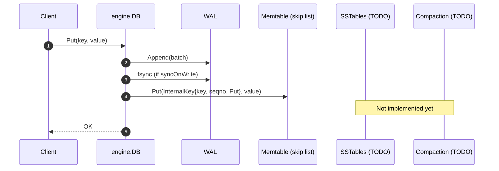
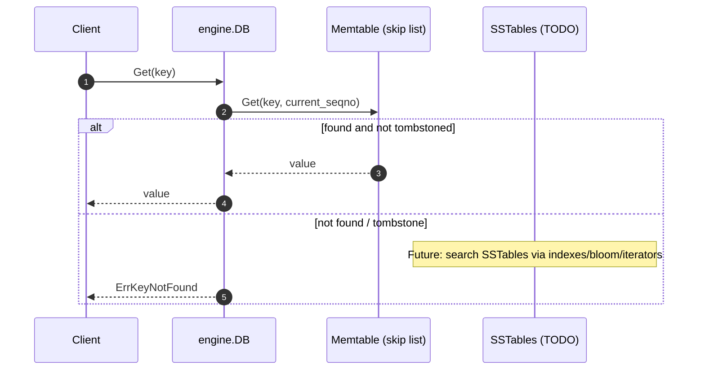
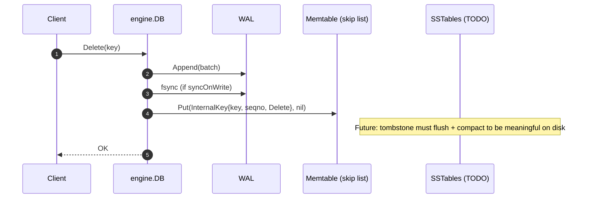

> **TL;DR**: BeachDB v0.0.2 ships the memtable — a skip list that replaces the placeholder map. This post covers why maps don't work for LSM storage, how internal key ordering makes "newest version wins" fall out naturally, and why deletes are actually writes.
>
> This post includes: two interactive demos and a few diagrams to drive the current architecture home.
{: .prompt-info }

_This is part of an ongoing series — see all posts tagged [#beachdb](/tags/beachdb/)._

---

## Alas, a memory table!

[v0.0.2](https://github.com/aalhour/beachdb/releases/tag/v0.0.2) is out and it's where the green box in the LSM diagram (see: demo below) stops being a hand-wave: the memtable is now a real data structure (a skip list), and the engine uses internal keys + tombstones + an iterator interface that we’ll need later.

Before we zoom into the memtable, I think it's worth it to review what was done so far and where BeachDB stands *today*.

## A quick recap

In the [last post](), I shipped [v0.0.1](https://github.com/aalhour/beachdb/releases/tag/v0.0.1) which contained the spine of BeachDB: a small storage-engine API (`Put`, `Get`, `Delete`), locking, WAL durability, and crash recovery, in addition to runnable examples under [`examples/engine/`](https://github.com/aalhour/beachdb/tree/main/examples/engine).

Here's a quick recap of what BeachDB can and can't do as of v0.0.2 - current tagged release.

### What it can do now

- **Serve a real in-process API**: `Put`, `Get`, `Delete` (with coarse locking).
- **Be honest about durability**: writes go to the WAL and can be replayed after a crash.
- **Recover state on restart** by replaying the WAL into the memtable.
- **Represent deletes correctly** (tombstones), instead of pretending delete means “remove from a map.”

### What it can't do yet

- **No SSTables yet** (no flushing the memtable to immutable sorted files on disk).
- **No compaction** (no merging/rewriting levels, no garbage collection of tombstones).
- **No on-disk read path** (no bloom filters, no indexes, no “search disk files efficiently”).
- **No snapshot API** yet (seqno exists, but it’s internal for now).

And the big one:

- **Your data is not persisted as a database file yet.**
  The WAL is a *durability log*, not a data store. It’s the “what happened?” receipt so we can reconstruct memtable state after a crash, but it is not where you want to search once the dataset stops fitting in memory.

---

## Refresher: the LSM demo

In the intro post ["Building BeachDB: A Database from Scratch (in Go)"](), I used an interactive visualization to explain the general flow of an LSM-tree.

At a high level, LSM flow is simple:

- **Writes** land in two places: appended to the WAL (durability) and inserted into the memtable (readability).
- **Reads** consult the memtable first (fast, sorted in-memory), and later will fall through to SSTables on disk.
- **In the background** (future milestones), full memtables flush into SSTables, and compaction rewrites/merges those files to keep reads sane.


<br>
In the diagram above, here’s what’s true *today* in BeachDB:

- **WAL**: implemented (see: [v0.0.1](https://github.com/aalhour/beachdb/releases/tag/v0.0.1), and the [previous post]())
- **Memtable**: implemented ([v0.0.2](https://github.com/aalhour/beachdb/releases/tag/v0.0.2) — this post)

Everything else in the disk plane is still TODO — intentionally (see: [recap section](#a-quick-recap) above).

This is exactly why the memtable is the right next milestone: without a sorted memtable, you can’t flush to a sorted SSTable, and the rest of the disk plane doesn’t make sense yet.

---

## So what is a Memtable really?

In an LSM engine, a memtable is the in-memory structure that holds the newest writes *in sorted order*.

It’s doing a few jobs at once:

- **Write buffer**: accept writes without immediately doing random I/O on disk.
- **Read your own writes**: reads must consult it first because it contains the newest state.
- **Future proofing**: when it fills up, it can be flushed to an on-disk sorted structure (an SSTable) without doing a full sort at flush time.

This isn’t a BeachDB invention — it’s the same “shape” you’ll find in real systems:

- **RocksDB** calls it a MemTable, turns full ones into *immutable* memtables, and flushes them to SST files in the background.[^1]
- **LevelDB** has a `MemTable` that’s literally built on a skip list (`db/skiplist.h`).[^2]
- **Cassandra** is also LSM-based: commit log (WAL) + memtables + SSTables + compaction.[^3]
- **HBase** uses the same idea under a different name (`MemStore`): in-memory modifications that later get flushed.[^4]

So when I say “memtable”, read it as: “the mutable, in-memory, sorted truth… until it’s flushed and becomes someone else’s problem.”

### v0.0.1: the deliberate placeholder (a `map`)

In v0.0.1, the “memtable” was a `map[string][]byte` (see: [engine/db.go#L25](https://github.com/aalhour/beachdb/blob/9c78234d73631abe102163c12c1c558c1c6b6055/engine/db.go#L25)). That wasn’t me being naive, it was a deliberate decision to ship a working spine:

- prove durability with the WAL
- prove recovery by crash-looping the engine
- keep the rest of the scope from exploding

Once that foundation was real, the map became the obvious next thing to replace.

Because maps are great when all you need is “key → value”, but an LSM memtable needs more:

- **Sorted order** (iteration + flushing later)
- **Versioning** (because “newest wins” becomes a real invariant once the system has more than one place to look)
- **Tombstones** (because deletes are writes, and deletes have to make it to disk later)

## Memtable v1: a skip list

At a high level, the memtable needs to:

- store entries in **sorted order**
- support fast-ish inserts and lookups (call it **O(log n)**-ish)
- give me a natural iterator (level 0 is just a linked list)

That combination is basically screaming for a data structure that’s ordered *and* update-friendly. A skip list is a great fit here.

> A skip list is what you reach for when you want an ordered map, but you don’t feel like doing tree rotations for a living.
>
> It keeps a plain sorted linked list at the bottom, then builds a few “express lanes” on top by randomly promoting some nodes. That randomness is the whole point: it keeps the structure balanced *enough* that lookups/inserts/deletes are **expected** `O(log n)`, without an explicit rebalancing algorithm.
{: .prompt-tip }

Translation: think “sorted linked list with express lanes”. If you want the formal definition + diagrams, Wikipedia is solid.[^7]

So for v0.0.2 I implemented the memtable as a skip list.[^5] Which I *thought* I’d never built before, until I remembered I did it in 2015 in C# while prepping for BigTech™️ interviews.[^6] (Memory is a leaky cache.)

### Skip List Demo

Play with it yourself. Insert a few keys and watch:

- how level 0 stays a plain sorted list,
- how some nodes randomly get promoted to higher “express lanes,”
- and how those lanes let a search jump forward and then drop down.



> Non-critical, but fun (and genuinely useful): I also wrote a small reference model and a deterministic randomized test harness to beat up the skip list. If you want that rabbit hole, it’s in [**Appendix A**](#a-testing-a-reference-model-and-randomized-runs).
>
> If you want the theory detour too, I added an MIT lecture link to [**Appendix D**](#d-skip-list-theory-mit-lecture).
{: .prompt-info }

---

## Internal keys: order is the whole trick

Now we can talk about the thing the memtable is actually sorting: **internal keys**.

The skip list is the vehicle. Internal keys are the point.

The mental shift is:

- Hash map model: **key → value**, overwrite in place.
- LSM model: **key → versions**, append new facts, and let “newest wins” fall out of ordering.

If you’ve never built an LSM-ish thing before, here’s the non-mystical translation:

- the database doesn’t store one value per key
- it stores a *timeline* of versions for the same key
- reads answer: “as of sequence number X, what’s the newest visible version?”

BeachDB’s internal key is:

- `user_key`: what the application passes in, e.g. key "name" --> value "Ahmad"
- `seqno`: a monotonic counter assigned by the DB on every mutation
- `kind`: Put (0x01) or Delete (0x02)

And the ordering is:

- \(user\_key\) ascending
- \(seqno\) **descending** (newest first)

That descending seqno part is the trick. It means “latest version wins” isn’t a special case — it’s just “the first entry for this user key.”

Example:

```
Operations (in order):
1. Put("key", "old_value")    -> seqno 5
2. Put("key", "new_value")    -> seqno 10
3. Delete("key")              -> seqno 15

Stored sorted as (user_key, seqno, kind):
1. ("key", 15, Delete) -> nil
2. ("key", 10, Put)    -> "new_value"
3. ("key", 5,  Put)    -> "old_value"
```

Same thing, as a table (sorted by `user_key` ↑, then `seqno` ↓):

| user_key | seqno | kind   | value       | What `Get("key")` sees |
|---------:|------:|--------|-------------|-------------------------|
| `key`    | 15    | Delete | —           | **NotFound (wins)**     |
| `key`    | 10    | Put    | `new_value` | (shadowed)              |
| `key`    | 5     | Put    | `old_value` | (shadowed)              |

So a read is conceptually boring: find the first entry for that `user_key` at or below your read sequence number, and that’s the answer.

And here’s the comparison function that makes that ordering real:

```go
func (k InternalKey) Compare(other InternalKey) int {
  // Compare the two keys (bytes) to each other
  cmp := bytes.Compare(k.UserKey, other.UserKey)

  // If they're not equal, return the result (1 or -1) --> greater/less than
  if cmp != 0 {
    return cmp
  }

  // They're equal, compare Seqno
  if k.Seqno > other.Seqno {
    return -1
  }
  if k.Seqno < other.Seqno {
    return 1
  }

  // Both keys (bytes) and sequence numbers are equal, return 0 (equality)
  return 0
}
```

Today, `seqno` is still internal (no snapshot API yet). `Get(key)` just reads “as of now” by using the database’s current seqno. But this is the exact shape we’ll need later when snapshots and merge iterators show up.

## What about deletes?

If you’re new to LSMs, this is the weird part: `Delete(key)` doesn’t remove anything.

It was certainly a surprise for me the first time I encountered it in the excellent _"Designing Data-Intensive Applications"_[^8] book by Martin Kleppmann and then again in HBase and how it implements it in its LSM-tree architecture.

It writes a **tombstone**: an entry with the same user key, a higher seqno, and `Kind=Delete`.

What does a tombstone *do*? It’s a newer fact that says “as of seqno N, this key is gone.” Since newer wins, reads will hit the tombstone first and treat the key as “not found” (even if older Put versions still exist underneath).

Here’s that same idea as a “version stack” for one key (newest on top):

| Newest → Oldest | seqno | kind   | value       | Visible to reads? |
|-----------------|------:|--------|-------------|-------------------|
| 1               | 15    | Delete | —           | **Yes → NotFound** |
| 2               | 10    | Put    | `new_value` | No (covered)      |
| 3               | 5     | Put    | `old_value` | No (covered)      |

Why not just remove the entry?

Because later milestones depend on this being correct:

1. **Flush correctness**: SSTables need tombstones so older SSTables know a key is dead.
2. **Compaction**: tombstones have to propagate down levels until it’s safe to drop them.

This is one of those rules that feels annoying until you try to build without it.

---

## Diagrams: Current flows (today)

Here’s the current reality, as sequence diagrams. Anything that mentions SSTables or compaction is still marked as TODO, because those are the next milestones.

### Put API flow


<br>

### Get API flow


<br>

### Delete API flow


<br>

---

## What’s next

Next milestone is the one that makes the “database” part feel real:

- **Frozen memtables**
- **Flush to SSTables**
- and then: merge iterators, on-disk reads, and finally compaction

Until then, BeachDB is basically an in-memory database with a durability log and crash recovery — which is a weirdly honest intermediate state.

It’s also (accidentally) a **strongly consistent, in-memory-only** database right now: a single writer, serialized seqnos, and one lock to rule them all. The “disk database” part starts at SSTables.

---

## Appendix & extras

### A. Testing: a reference model and randomized runs

I added a small reference model (`internal/testutil.Model`) that stores *all versions* of all keys and answers the only question that matters for a memtable: “what should `Get(key)` return at sequence number X?”.[^9]

The model is deliberately boring:

- it records every `PutAt(key, value, seqno)` and `DeleteAt(key, seqno)` as an append-only list
- `GetAt(key, seqno)` returns the newest entry with `entry.seqno <= seqno`
- if that newest entry is a delete, it returns “not found” (tombstone wins)

Then I used that model to beat up the skip list with a randomized test that’s deterministic (seeded RNG), reproducible, and surprisingly good at catching “wait… but what if?” bugs.[^10]

The gist:

- pre-generate a pool of ~100 keys so overwrites/deletes actually happen
- run 5,000 operations, bumping a local `seqno` every time
- 70% `Put` (random value), 30% `Delete` (tombstone)
- after each op: pick 10 random keys and assert `skipList.Get(key, seqno)` matches `model.GetAt(key, seqno)`
- at the end: scan the whole key pool again and verify everything matches

Also: I’m digging Go’s `testing` package more than I expected. `t.Logf` for breadcrumbs, `t.Fatalf` to stop at the first “this makes no sense”, and determinism-by-default makes randomized tests feel… civilized.

If you want the full thing, read `internal/memtable/skiplist_random_test.go` end-to-end — it’s short and pretty self-explanatory.[^9]

### B. Iterators: the memtable “sees the truth”

The memtable iterator exposes **everything**:

- every version of every key
- puts and tombstones
- no filtering, no deduplication

That’s intentional. In an LSM, each layer has a job:

- **memtable iterator**: produce a sorted stream of internal keys
- **merge iterator** (later): merge memtable + SSTables into one sorted stream
- **user-facing iterator** (later): apply snapshot visibility rules, hide tombstones, dedupe versions

Right now iterators aren’t really a “public API feature.” They’re plumbing I need for flushing and for the read path once SSTables exist.

### C. Concurrency (and the footgun)

BeachDB is still “single-process, in-process engine,” so I’m keeping concurrency simple:

- `DB` has a coarse `sync.RWMutex`
  - writes take the exclusive lock
  - reads take the shared lock

The memtable iterator has a footgun by design:

- it grabs a **read lock** on the skip list when you first `Seek()` / `SeekToFirst()`
- it holds that lock until you call `Close()`
- concurrent writes block until `Close()`

If you forget to call `Close()`, you’ve basically deadlocked writers. The compiler won’t save you.

The implementation is small enough to paste:

```go
func (it *SkipListIterator) acquireLock() {
	if !it.locked {
		it.list.mu.RLock()
		it.locked = true
	}
}
```

This is fine *for now*, because the next milestone (SSTables) introduces the frozen-memtable pattern:

- memtable fills up → freeze it (read-only)
- route new writes to a fresh memtable
- iterators over the frozen one no longer block writers

### D. Skip list theory (MIT lecture)

If you want to dig deeper into Skip Lists and the theory behind them, then look no further than MIT’s algorithms course, which has a great lecture on the topic:



---

## Notes & references

[^1]: [RocksDB Wiki, “MemTable”](https://github.com/facebook/rocksdb/wiki/Memtable)
[^2]: [LevelDB source, `db/memtable.h`](https://github.com/google/leveldb/blob/main/db/memtable.h) (includes `db/skiplist.h`)
[^3]: [Apache Cassandra docs, “Storage Engine”](https://cassandra.apache.org/doc/latest/cassandra/architecture/storage-engine.html)
[^4]: [Apache HBase API, `MemStore` interface](https://hbase.apache.org/2.4/devapidocs/org/apache/hadoop/hbase/regionserver/MemStore.html)
[^5]: The memtable is specified as an interface in [internal/memtable/memtable.go](https://github.com/aalhour/beachdb/blob/dd5c945f32ba39649a5194957880baa619ddba25/internal/memtable/memtable.go), and it's implemented as a SkipList in [internal/memtable/skiplist.go](https://github.com/aalhour/beachdb/blob/dd5c945f32ba39649a5194957880baa619ddba25/internal/memtable/skiplist.go). The same polymorphic pattern is used for the iterator: the interface is specified in [internal/memtable/iterator.go](https://github.com/aalhour/beachdb/blob/dd5c945f32ba39649a5194957880baa619ddba25/internal/memtable/iterator.go) and the SkipList implements `SkipListIterator` in [internal/memtable/skiplist.go#L224-L324](https://github.com/aalhour/beachdb/blob/dd5c945f32ba39649a5194957880baa619ddba25/internal/memtable/skiplist.go#L224-L324). This allows extensibility and pluggability of other implementations in the future.
[^6]: [My old C# skip list implementation (2015)](https://github.com/aalhour/C-Sharp-Algorithms/blob/master/DataStructures/Lists/SkipList.cs)
[^7]: [Wikipedia: Skip list](https://en.wikipedia.org/wiki/Skip_list)
[^8]: [Designing Data-Intensive Applications](https://dataintensive.net/)
[^9]: Reference model: [internal/testutil/model.go](https://github.com/aalhour/beachdb/blob/dd5c945f32ba39649a5194957880baa619ddba25/internal/testutil/model.go)
[^10]: Randomized model-vs-skiplist test: [internal/memtable/skiplist_random_test.go](https://github.com/aalhour/beachdb/blob/dd5c945f32ba39649a5194957880baa619ddba25/internal/memtable/skiplist_random_test.go)
