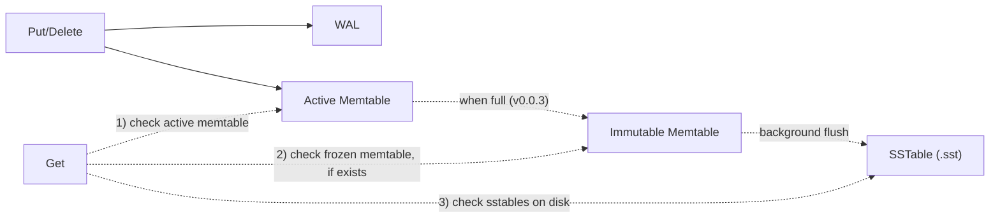
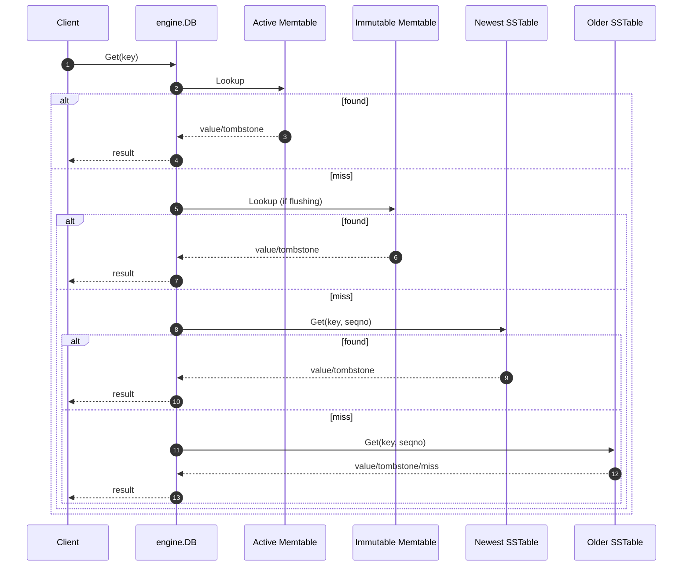

> **TL;DR**: BeachDB v0.0.3 is out, and it ships SSTables v1: immutable sorted files on disk, a real memtable flush path, on-disk reads, and an `sst_dump` tool so I can inspect the bytes instead of trusting vibes. This is the milestone where BeachDB stops being an in-memory engine with a WAL and starts having a real disk plane. [Code is here](https://github.com/aalhour/beachdb).
{: .prompt-info }

_This is part of an ongoing series — see all posts tagged [#beachdb](/tags/beachdb/)._

---

## The disk plane finally gets real!

This milestone took a while to ship, and I learned a ton about on-disk persistance in the process, but it's finally here!

[BeachDB v0.0.3](https://github.com/aalhour/beachdb/releases/tag/v0.0.3) is the milestone where the LSM diagram stops bluffing. The path to disk is now clear, writes and deletes no longer just live in the memory plane and get tracked in the WAL for durability, but they also get flushed to disk in a file format that allows for efficient indexing and reading. It also sets us up for implementing more cool read optimizations in the future - the Sorted-String Tables (SSTables) are here.

But before we dive deep into what an SSTable is, the file format and how BeachDB implements this part of the LSM-Tree architecture, let's do a quick recap of what we've built so far.

## A quick recap

In the [last post](), I shipped [v0.0.2]((https://github.com/aalhour/beachdb/releases/tag/v0.0.2)) which implemented the Memtable part of the LSM-tree architecture and connected it to the WAL (see: interactive demo below).

But, BeachDB still didn't persist data on-disk.

That gap matters more than it sounds. A memtable plus a WAL is already useful, but it is still a strange intermediate creature:

- new writes are durable because of the WAL
- new writes are readable because of the memtable
- but the disk plane itself is still mostly a promise

SSTables are the milestone where that promise starts cashing out.

This release ships the first real on-disk table format in BeachDB, wires the engine to flush memtables into it, teaches the read path to consult those files, and ships a tiny `sst_dump` tool so I can inspect the resulting bytes from outside the database.

If [`v0.0.1`]((https://github.com/aalhour/beachdb/releases/tag/v0.0.1)) was "durability is now real" and [`v0.0.2`]((https://github.com/aalhour/beachdb/releases/tag/v0.0.2)) was "the in-memory shape is now real", then [`v0.0.3`]((https://github.com/aalhour/beachdb/releases/tag/v0.0.3)) is: the first real database files now exist.

Before this milestone, BeachDB could already:

- append committed writes to a WAL and `fsync` them
- recover state after restart by replaying that WAL
- maintain a sorted memtable using internal keys
- represent deletes as tombstones instead of pretending delete means "remove from a map"

What it could not do yet was just as important:

- flush memtable contents into immutable sorted files on disk
- answer `Get()` by falling through to on-disk files
- reopen the database and discover SSTables as part of normal startup
- inspect a table file, because table files did not exist yet

That missing edge in the architecture is basically this:



That memtable -> SSTable arrows are what this milestone is about.

Before v0.0.3, the memtable was the destination. After v0.0.3, it becomes what it was always supposed to be: a staging area.

## So, what is an SSTable?

The term "SSTable" is short for: Sorted-String Tables. It's a file format and a technique that storage engines use to write data, in a sorted manner, to files on disk. It comes from the Bigtable paper[^1], but the shape has escaped into a lot of other systems: LevelDB, RocksDB, Pebble, HBase/HFile, Cassandra, and a bunch of smaller LSM engines too.[^3][^4][^5]

In BeachDB, an SSTable is just an **immutable sorted file of key-value pairs** written from a sealed memtable.[^7]

That's the whole idea, minus the mysticism.

It is not a "table" in the SQL sense. It is not a schema object. It is not a user-facing abstraction. It is a storage-engine file with one job:

- take sorted internal keys from memory
- write them to disk in sorted order
- include enough structure that a reader can find things without scanning the whole file

If you want the 10,000-ft storage-engine view, Martin Kleppmann's work is still the cleanest starting point I know: Chapter 3 of _Designing Data-Intensive Applications_ and his map of the data-systems landscape do a great job of situating log-structured storage engines in the bigger picture.[^2]

### The plain-text version first

Before we talk bytes, I think it's worth looking at the idea in plain text.

Suppose a tiny key-value store has already flushed two generations of data to disk:

```text
# 000001.sst  (older)
apple@1  Put     = "red"
banana@2 Put     = "yellow"

# 000002.sst  (newer)
apple@3  Put     = "green"
banana@4 Delete  = <tombstone>
```

Now a `Get("apple")` does not mean "look in one file." It means:

1. check memory first
2. if memory misses, check the newest SSTable
3. if still missing, keep going backward through older SSTables

So:

- `Get("apple")` returns `"green"` because the newer file shadows the older one
- `Get("banana")` returns "not found" because the tombstone in the newer file shadows the older put

That is the part I think is easiest to miss when people hear "simple key-value store." Even a tiny LSM-ish system stops being "one map on disk" pretty quickly. It becomes:

- a few sorted files
- ordered newest-to-oldest
- plus a couple of rules about shadowing and tombstones

The binary format is just the concrete version of that story.

## What is the SSTable format in BeachDB?

Every storage engine reaches this point and has to make a few decisions:

1. Should data be stored in one giant sorted blob or in a file that has a block-based layout?
1. Should the file has a header or a footer for bootstrapping the read process?
1. Should the metadata live in a different file or should the data file be self-contained?
1. Should we store full keys or compressed keys?
1. Should we store the whole-file checksum or a per-block checksum in the file?

BeachDB's answers for v1 of the SSTable format are intentionally conservative, and they line up pretty well with how the grown-ups think about the problem.[^3][^4][^5][^6]

### 1. Blocked file layout, not one giant sorted array

The file layout is:

```text
[data block 0][data block 1]...[data block N][index block][footer]
```

That matches the core shape used by LevelDB and RocksDB-style table formats: blocked storage, an index to hop to the right block, and a small bootstrap record that tells the reader where the index lives.[^3][^4]

The reasons are pretty practical:

- faster seeks
- checksum validation at useful granularity
- room for future compression/filter blocks later

Or, said less formally: once the file stops being toy-sized, nobody wants point lookups to do a heroic whole-file scan every time.

### 2. Footer at EOF, not a file header

This is one of my favorite parts of the design.

BeachDB's SSTable does **not** have a file header that the reader uses to bootstrap the file. Instead, it has a fixed-size footer at the very end of the file. The reader:

1. seeks to EOF minus 40 bytes
2. validates the footer
3. gets the index offset and size from that footer
4. reads the index
5. uses the index to locate data blocks

This is very much in the LevelDB/RocksDB family of thinking: the footer is the trust anchor.[^3][^4] It gives the reader a fixed bootstrap point without having to scan or guess.

That also means the answer to "where is the header?" is: **there isn't one, at least not in the file-format-bootstrap sense.**

The WAL needs per-record headers because it is an append-only log. The SSTable is a finished immutable file, so its bootstrap metadata lives more naturally at EOF.

### 3. The index lives inside the file

This was non-negotiable for me.

The SSTable owns its own block index. It is not stored in a sidecar file. It is not reconstructed from directory metadata. It is not hidden behind some later manifest layer.

Why?

- because the file should be self-describing
- because `sst_dump` should be able to explain one file in isolation
- because a reader opening one SSTable should not need outside context just to navigate inside it

That distinction matters:

- the **SSTable index** helps you navigate *inside one file*
- the **engine-level metadata** helps you decide *which files to consult at all*

Those are related problems, but they are not the same problem.

### 4. Full internal keys, not compression theater

BeachDB v1 stores full internal keys in every data entry:

- `user_key`
- `seqno`
- `kind`

That is less space-efficient than what RocksDB eventually does, but much easier to inspect and reason about.

This was a deliberate design decision in the milestone plan: if the point of v1 is to make the file format inspectable and easy to debug, compressed prefixes and restart arrays are complexity in exactly the wrong place.[^6]

Full keys are:

- easier to hex-dump
- easier to specify correctly
- easier to sanity-check when the reader or writer is broken

This is a learning-first format, not an optimization contest.

### 5. Per-block CRC32C, plus a footer checksum

Every data block gets its own CRC32C trailer. The index block gets one too. The footer has its own checksum as well.

That buys a very useful invariant:

> if the bytes are corrupt, the reader should complain loudly instead of hallucinating correctness.

This is also standard storage-engine hygiene. The task notes I wrote before coding this explicitly called out checksum discipline as one of the core lessons of the milestone: you detect corruption at the granularity of your checksums, no finer.[^6]

## BeachDB's SSTable v1 in one screen

The formal spec lives in [`docs/formats/sstable.md`](https://github.com/aalhour/beachdb/blob/main/docs/formats/sstable.md), but the short version is:

```text
[data block 0][data block 1]...[data block N][index block][footer]
```

Each data entry is:

```text
[internal_key_len:4][internal_key_bytes][value_len:4][value_bytes]
```

Each index entry is:

```text
[last_internal_key_len:4][last_internal_key_bytes][block_offset:8][block_size:4]
```

And the fixed-size footer is:

```text
[magic:8][version:4][index_offset:8][index_size:4][data_block_count:4][entry_count:8][checksum:4]
```

The two most important design details are:

- entries are sorted by `(user_key ASC, seqno DESC)`
- the index stores the **last internal key** of each data block

That second part is the trick that makes point reads efficient inside one SSTable. The reader constructs a synthetic "maximum possible version" for the target user key, binary-searches the index for the earliest block whose last key could still contain that user key, and then only scans the relevant block(s).

Or in plainer English: the index tells the reader where the answer could plausibly live, and the reader only goes spelunking there.

## Running it locally and opening a real file

This is the part I wanted most from the milestone.

It is one thing to design a format on paper. It is another to run the database locally, create an actual `.sst` file, and open it from outside the engine.

While writing this post, I ran a tiny demo program locally that does exactly four mutations:

```go
db, err := engine.Open("/tmp/beachdb-sst-post-demo", engine.WithMemtableFlushSize(200))
if err != nil {
    log.Fatal(err)
}

ctx := context.Background()

_ = db.Put(ctx, []byte("apple"), []byte("red"))
_ = db.Put(ctx, []byte("banana"), []byte("yellow"))
_ = db.Put(ctx, []byte("apple"), []byte("green"))
_ = db.Delete(ctx, []byte("banana"))

_ = db.Close()
```

That produced these files on my machine:

```text
/tmp/beachdb-sst-post-demo/000000.sst 183 bytes
/tmp/beachdb-sst-post-demo/beachdb.wal 227 bytes
```

That file list is worth pausing on.

Even after the flush exists, the WAL is still there. That is intentional. WAL retirement and manifest-backed lifecycle management are later milestones. v0.0.3 is about teaching BeachDB how to write SSTables, not about finishing the metadata story around them.

### `sst_dump` on a real BeachDB file

Then I pointed `sst_dump` at the generated SSTable:

```text
$ sst_dump -entries /tmp/beachdb-sst-post-demo/000000.sst
SSTable: /tmp/beachdb-sst-post-demo/000000.sst
  Version: 1
  Entries: 4
  Data blocks: 1
  Index block: offset=108 size=35

Blocks:
  Block 0: offset=0 size=108 last_key="banana" seqno=2

Entries:
  [0] Put    key="apple" seqno=3 value=5 bytes
  [1] Put    key="apple" seqno=1 value=3 bytes
  [2] Delete key="banana" seqno=4 value=0 bytes
  [3] Put    key="banana" seqno=2 value=6 bytes
```

This makes me unreasonably happy.

A few things worth noticing:

- the entries are sorted by internal key, not by mutation order
- the newer `apple` version (`seqno=3`) appears before the older one (`seqno=1`)
- the `banana` tombstone (`seqno=4`) appears before the older `banana` put (`seqno=2`)
- the index block starts at offset `108`, which is exactly the size of the one data block

That is the memtable ordering story surviving the trip to disk.

### Looking at the raw bytes

Now for the part I was genuinely looking forward to: the footer and index in a hex dump.

```text
$ xxd -g 1 -s 0x6c -l 80 /tmp/beachdb-sst-post-demo/000000.sst
0000006c: 00 00 00 0f 62 61 6e 61 6e 61 00 00 00 00 00 00  ....banana......
0000007c: 00 02 01 00 00 00 00 00 00 00 00 00 00 00 6c 61  ..............la
0000008c: 24 d0 c0 42 45 41 43 48 53 53 54 00 00 00 01 00  $..BEACHSST.....
0000009c: 00 00 00 00 00 00 6c 00 00 00 23 00 00 00 01 00  ......l...#.....
000000ac: 00 00 00 00 00 00 04 c7 ea 8f 42                 ..........B
```

This slice starts at offset `0x6c`, which is where the index block begins in this file.

Here's how to read it:

- `00 00 00 0f` -> index key length = 15 bytes
- `62 61 6e 61 6e 61 ... 00 02 01` -> last internal key in the only data block: `"banana"` with `seqno=2`, `kind=Put`
- `00 00 00 00 00 00 00 00` -> block offset = `0`
- `00 00 00 6c` -> block size = `108`
- `61 24 d0 c0` -> index block checksum
- `42 45 41 43 48 53 53 54` -> ASCII `BEACHSST`
- `00 00 00 01` -> version 1
- `00 00 00 00 00 00 00 6c` -> index offset = `108`
- `00 00 00 23` -> index size = `35`
- `00 00 00 01` -> data block count = `1`
- `00 00 00 00 00 00 00 04` -> entry count = `4`
- `c7 ea 8f 42` -> footer checksum

This is also why I chose big-endian for the binary formats. It is just nicer in a hex dump.

There is something deeply satisfying about being able to point at `BEACHSST` in raw bytes and say: yes, that is the file magic, yes, that offset is the index block, yes, the numbers line up with the dump tool, and no, I am not relying on optimism as a parsing strategy.

## The flush path: how real engines do it, and what BeachDB copied

Designing the file format was only half the milestone. The other half was figuring out how to move state from memory to disk without turning the write path into a deadlock or an I/O hostage situation.

While working through auto-flush, I spent some time studying how a few production LSM engines handle the same problem: LevelDB, Pebble, RocksDB, and BadgerDB.[^5]

The striking thing is how much they agree on the shape:

1. writer notices the memtable is full
2. current memtable becomes immutable
3. a fresh memtable takes over for new writes
4. a background worker flushes the immutable one to an SSTable
5. if too many immutable memtables pile up, writers stall
6. reads check memory first, then immutable memtables, then SSTables

That's the universal pattern. The differences are mostly in queue depth, backpressure sophistication, and concurrency.

### LevelDB: the canonical version

LevelDB is the cleanest reference point for this milestone.[^3]

Its shape is:

- one active memtable
- one immutable memtable slot (`imm_`)
- one mutex
- one condition variable
- one background worker

If the active memtable is full and `imm_` is already occupied, writers stall on the condition variable. If `imm_` is empty, the current memtable is rotated into that slot and the background worker is signaled.

That design is boring in exactly the right way.

### Pebble: same idea, but with a queue

Pebble is CockroachDB's Go LSM engine, and it is especially relevant because it is both modern and in Go.[^5]

It follows the same underlying pattern, but instead of one immutable slot it maintains a queue of flushable memtables. Writers stall only when that queue gets too deep.

The interesting part isn't "Pebble is different." It's that Pebble is basically saying:

> yes, the LevelDB story is right; I just want a larger waiting room before I start stalling writers.

### RocksDB: same story, more machinery

RocksDB generalizes the idea further:

- multiple immutable memtables
- thread pools
- soft backpressure before hard stop
- more concurrency overall

This is great if you're Facebook and less compelling if you're me writing BeachDB in public on weekends.

RocksDB's design is valuable here mostly as proof that the same pattern scales up, not as something BeachDB should copy wholesale right now.[^5]

### BadgerDB: channels instead of condvars

BadgerDB is the outlier in the research notes because it leans more into Go channels.[^5]

That sounds attractive on paper, but the comparison actually pushed me away from it. The read path still needs a visible list/slice of immutable memtables, and channel-based stalling turns out to be more awkward than `cond.Wait()` because you end up manually dropping and reacquiring locks around channel operations.

In other words: more Go-ish on the surface, more annoying in the important part.

### What BeachDB chose

BeachDB takes the LevelDB shape, keeps the single immutable slot, and combines it with `sync.RWMutex` plus `sync.Cond` on the write side.

That gives me:

- a background flush goroutine
- clean writer stalling when needed
- active memtable -> immutable memtable -> SSTable flow
- readers still using `RLock()` independently

This was also partly forced by correctness. The design notes caught an inline-flush deadlock in the original approach: calling flush directly from `Write()` while already holding the DB lock was going to re-enter the lock and wedge the whole thing.[^5]

So the final v0.0.3 shape is:

- writer appends to WAL
- writer applies batch to memtable
- if threshold crossed and no immutable memtable is being flushed:
  - rotate current memtable into `immMem`
  - install a fresh memtable
  - signal background flush goroutine
- if `immMem` is already occupied:
  - stall writer on `sync.Cond`

That is the first time BeachDB really behaves like an LSM engine instead of a WAL-centric demo.

## The read path: memory first, disk after, newest wins

Once SSTables exist, `Get()` changes shape too.

Before the bullets, here's the mental model I keep in my head: **reads do a small scavenger hunt across time**. The newer the state, the cheaper it is to find.

BeachDB's read path is now:

1. active memtable
2. immutable memtable (if flush is in progress)
3. SSTables newest-first

That is not just a BeachDB quirk. It is the same basic read story the auto-flush research surfaced across LevelDB, Pebble, RocksDB, and BadgerDB: recent state in memory, older immutable state after that, disk files after that.[^5]

Here's the current shape:



Inside one SSTable, the read story is:

1. read footer
2. read index
3. binary-search index for the earliest candidate block
4. load that block
5. scan entries in internal-key order
6. continue to the next block if the same user key might span the boundary

That last point is a deliberate v1 tradeoff from the format spec: the writer does **not** try to keep all versions of one user key inside one block. That keeps the writer simpler and lets the reader handle the rare continuation case.[^6]

Again: a little more work on the read side, in exchange for a much simpler and more inspectable writer. I can live with that in v1.

## `sst_dump` is not optional tooling

One thing the milestone plan says explicitly, and I think it is right, is that `sst_dump` is not "nice-to-have CLI sugar." It is core debugging capability.[^6]

RocksDB ships `sst_dump` and `ldb`. LevelDB ships `leveldbutil`. These tools exist for a reason.

When something goes wrong in a storage engine, "well, the database API says X" is usually not enough. You want to know:

- did the file get created?
- how many entries are in it?
- where does the index start?
- what is the last key per block?
- did the checksum fail?

The tool is the shortest path from "this test failed in a confusing way" to "here is what the file actually contains."

It is also philosophically on-brand for BeachDB. The point of the project is not just to produce code that passes tests; it is to produce artifacts I can inspect, explain, and reason about from the outside.

If the file format is real, I should be able to open it.

## Testing, because storage engines should not run on vibes

This milestone added a lot of code, but more importantly it added a lot of proof.

At the SSTable package level, the test surface covers:

- writer behavior
- reader behavior
- iterator behavior
- corruption handling
- footer/index/block validation
- lookups across versions and tombstones
- block splitting and edge cases
- concurrency on the read side

At the engine level, there are integration tests for:

- flushing a memtable into a real SSTable
- reopening the DB and reading flushed state back
- multiple flushes producing multiple SSTables
- newer SSTables shadowing older ones
- tombstones surviving across flush boundaries
- immutable memtable visibility during flush
- `Close()` waiting for background flush to drain

And there are benchmarks/allocation guards around the hot paths too.

This is still a toy project. It is not a toy testing posture.

## What is still missing on purpose

Now that the disk plane exists, the remaining gaps get much more concrete.

BeachDB still does **not** have:

- a manifest/version set
- WAL retirement coordinated with flush state
- compaction
- bloom filters
- block cache
- merge iteration across all sources
- user-facing snapshots

Some of these are mostly performance features. Some become correctness or operability features once the number of SSTables grows.

But I wanted this milestone to lock in a simpler truth first:

- the file format exists
- the engine can flush to it
- the engine can read from it
- the bytes can be inspected

That is enough surface area for one release and, frankly, enough opportunities to embarrass myself with a bug in public.

## What's next

Now that BeachDB can create immutable sorted files, the next question becomes:

**how does it reason about more than one of them durably?**

Right now startup discovers `*.sst` files by scanning the directory. That is honest, simple, and temporary. The obvious next milestone is a **manifest**: an append-only record of which SSTables exist and what the current database view is supposed to be.

After that, the fun really starts:

- merge iteration across memtables and SSTables
- compaction
- eventually bloom filters and caching

In other words, BeachDB finally has a disk plane.

The next step is teaching it how not to turn that disk plane into a landfill.

Until then, I'm happy with this milestone for a simple reason:

BeachDB writes real database files now.

And I can open them.

Until we meet again.

Adios! ✌🏼

---

## Notes & references

[^1]: Bigtable is where the term "SSTable" comes from: [Bigtable: A Distributed Storage System for Structured Data](https://research.google/pubs/bigtable-a-distributed-storage-system-for-structured-data/).
[^2]: For the wider storage-engine mental model, see Martin Kleppmann's book [_Designing Data-Intensive Applications_](https://www.oreilly.com/library/view/designing-data-intensive-applications/9781491903063/), his map of the distributed/data systems landscape: [How to navigate the world of distributed data systems](https://martin.kleppmann.com/2017/03/15/map-distributed-data-systems.html), and his talk [Using logs to build a solid data infrastructure](https://martin.kleppmann.com/2015/06/05/logs-for-data-infrastructure-at-gds.html).
[^3]: LevelDB references that were especially useful here: [table file format](https://github.com/google/leveldb/blob/main/doc/table_format.md), [implementation overview](https://github.com/google/leveldb/blob/main/doc/impl.md), and [`db/db_impl.cc`](https://github.com/google/leveldb/blob/main/db/db_impl.cc).
[^4]: RocksDB references: [A Tutorial of RocksDB SST formats](https://github.com/facebook/rocksdb/wiki/A-Tutorial-of-RocksDB-SST-formats), [BlockBasedTable format](https://github.com/facebook/rocksdb/wiki/rocksdb-blockbasedtable-format), and [`db/db_impl/db_impl_write.cc`](https://github.com/facebook/rocksdb/blob/main/db/db_impl/db_impl_write.cc).
[^5]: Useful public references for flush/read-path design here were LevelDB, Pebble, RocksDB, and BadgerDB. Relevant source entry points: [Pebble `db.go`](https://github.com/cockroachdb/pebble/blob/master/db.go), [Pebble `compaction.go`](https://github.com/cockroachdb/pebble/blob/master/compaction.go), [Badger `db.go`](https://github.com/dgraph-io/badger/blob/main/db.go), and [Badger `memtable.go`](https://github.com/dgraph-io/badger/blob/main/memtable.go).
[^6]: BeachDB's public format/design docs for this milestone are [`docs/formats/sstable.md`](https://github.com/aalhour/beachdb/blob/main/docs/formats/sstable.md) and [`docs/architecture.md`](https://github.com/aalhour/beachdb/blob/main/docs/architecture.md).
[^7]: [The Memtable: where writes go to wait]()
