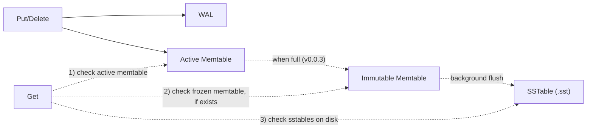
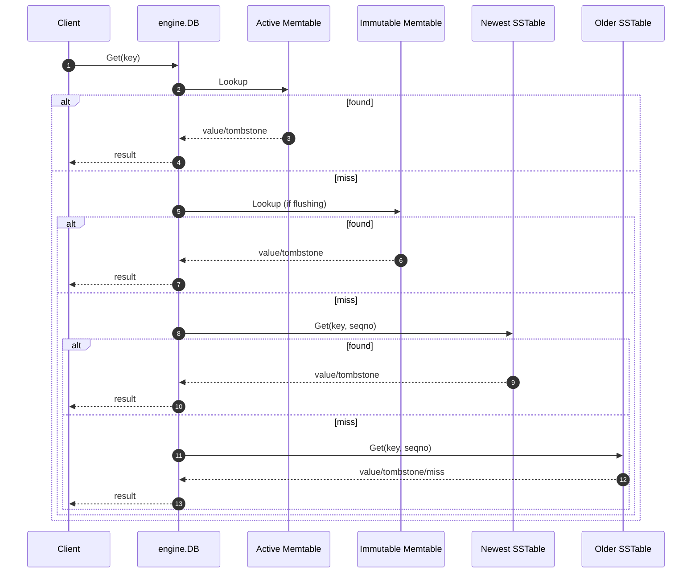
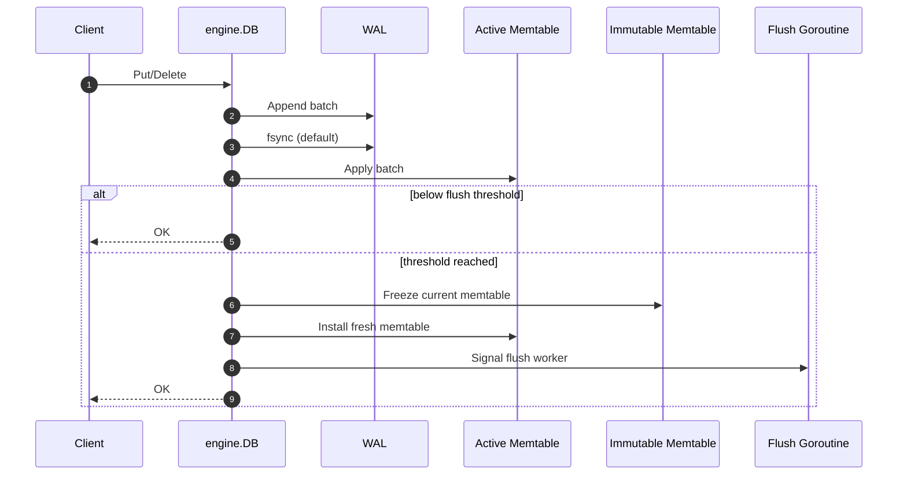

> **TL;DR**: BeachDB v0.0.3 is out, and it ships SSTables v1: immutable sorted files on disk, a real memtable flush path, on-disk reads, and an `sst_dump` tool so I can inspect the bytes instead of trusting vibes. This is the milestone where BeachDB stops being an in-memory engine with a WAL and starts having a real disk plane. [Code is here](https://github.com/aalhour/beachdb).
{: .prompt-info }

_This is part of an ongoing series — see all posts tagged [#beachdb](/tags/beachdb/)._

---

## The disk plane finally gets real!

This milestone took a while to ship, and I learned a ton about on-disk persistence in the process, but it's finally here!

[BeachDB v0.0.3](https://github.com/aalhour/beachdb/releases/tag/v0.0.3) is the milestone where the LSM diagram stops bluffing. The path to disk is now clear, writes and deletes no longer just live in the memory plane and get tracked in the WAL for durability, but they also get flushed to disk in a file format that allows for efficient indexing and reading. It also sets us up for implementing more cool read optimizations in the future - the Sorted-String Tables (SSTables) are here.

But before we dive deep into what an SSTable is, the file format and how BeachDB implements this part of the LSM-Tree architecture, let's do a quick recap of what we've built so far.

## A quick recap

In the [last post](), I shipped [v0.0.2](https://github.com/aalhour/beachdb/releases/tag/v0.0.2) which implemented the Memtable part of the LSM-tree architecture and connected it to the WAL (see: interactive demo below).

But, BeachDB still didn't persist data on-disk.

That gap matters more than it sounds. A memtable plus a WAL is already useful, but it is still a strange intermediate creature:

- new writes are durable because of the WAL
- new writes are readable because of the memtable
- but the disk plane itself is still mostly a promise

SSTables are the milestone where that promise starts cashing out.

This release ships the first real on-disk table format in BeachDB, wires the engine to flush memtables into it, teaches the read path to consult those files, and ships a tiny `sst_dump` tool so I can inspect the resulting bytes from outside the database.

If [`v0.0.1`](https://github.com/aalhour/beachdb/releases/tag/v0.0.1) was "durability is now real" and [`v0.0.2`](https://github.com/aalhour/beachdb/releases/tag/v0.0.2) was "the in-memory shape is now real", then [`v0.0.3`](https://github.com/aalhour/beachdb/releases/tag/v0.0.3) is: the first real database files now exist.

Before this milestone, BeachDB could already:

- append committed writes to a WAL and `fsync` them
- recover state after restart by replaying that WAL
- maintain a sorted memtable using internal keys
- represent deletes as tombstones instead of pretending delete means "remove from a map"

What it could not do yet was just as important:

- flush memtable contents into immutable sorted files on disk
- answer `Get()` by falling through to on-disk files
- reopen the database and discover SSTables as part of normal startup
- inspect a table file, because table files did not exist yet

That missing edge in the architecture is basically this:



That memtable -> SSTable arrows are what this milestone is about.

Before v0.0.3, the memtable was the destination. After v0.0.3, it becomes what it was always supposed to be: a staging area.

## So, what is an SSTable?

The term "SSTable" is short for Sorted String Table. It comes from Bigtable[^1], but the shape has escaped into a lot of other systems since then: LevelDB[^3], RocksDB[^4], Pebble[^5], HBase/HFile[^7], Cassandra[^8], and a bunch of smaller LSM engines too.

In BeachDB, an SSTable is just an **immutable sorted file of key-value pairs** written from a sealed memtable.

That's the whole idea, minus the mysticism.

It is not a "table" in the SQL sense. It is not a schema object. It is not a user-facing abstraction. It is a storage-engine file with one job:

- take sorted internal keys from memory
- write them to disk in sorted order
- include enough structure that a reader can find things without scanning the whole file

If you want the 10,000-ft storage-engine view, Martin Kleppmann[^2] is still the cleanest starting point I know. Chapter 3 of _Designing Data-Intensive Applications_ and his map of the data-systems landscape do a great job of situating log-structured storage engines in the bigger picture.

### The plain-text version first

Before we talk bytes, I think it's worth looking at the idea in plain text.

Suppose a tiny key-value store has already flushed two generations of data to disk:

```text
# 000001.sst  (older)
apple@1  Put     = "red"
banana@2 Put     = "yellow"

# 000002.sst  (newer)
apple@3  Put     = "green"
banana@4 Delete  = <tombstone>
```

Now a `Get("apple")` does not mean "look in one file." It means:

1. check memory first
2. if memory misses, check the newest SSTable
3. if still missing, keep going backward through older SSTables

So:

- `Get("apple")` returns `"green"` because the newer file shadows the older one
- `Get("banana")` returns "not found" because the tombstone in the newer file shadows the older put

That is the part I think is easiest to miss when people hear "simple key-value store." Even a tiny LSM-ish system stops being "one map on disk" pretty quickly. It becomes:

- a few sorted files
- ordered newest-to-oldest
- plus a couple of rules about shadowing and tombstones

The binary format is just the concrete version of that story.

If you want the bytes-on-disk deep dive, skip ahead to [What is the SSTable format in BeachDB?](#what-is-the-sstable-format-in-beachdb), [BeachDB's SSTable v1 in one screen](#beachdbs-sstable-v1-in-one-screen), or [Running it locally and opening a real file](#running-it-locally-and-opening-a-real-file). But first I want to stay top-down and follow what changed in the engine.

## Back to the LSM picture

In the intro post I used an LSM-tree demo to show the general shape of the system. It is still the right picture; the only thing that changed is that the `flush` arrow from the Memtable to disk (L0) has stopped being a promise and started being real code.


<br>
The old story was:

- writes land in the WAL
- writes land in the memtable
- later, in theory, the memtable flushes to SSTables on disk

`v0.0.3` is the milestone where that third bullet is no longer hypothetical.

I do not want to re-explain the whole LSM story here because the earlier posts already did that job. I only want to re-anchor the reader in the architecture and highlight the one edge that became real in this milestone:

- WAL: already real
- memtable: already real
- memtable -> SSTable flush: now real
- compaction, bloom filters, block cache, manifest/versioning: still later

Now let's follow that new journey from the API down into disk, and only later crack the file open.

## Same APIs, new journey

One thing I want to make explicit before the diagrams: the public API did **not** change in this milestone.

BeachDB already had:

- `Put`
- `Get`
- `Delete`

The novelty in `v0.0.3` is not "new API surface." It is that the data now has a longer and more interesting route through the engine.

There are now two new places state can live between "fresh write" and "old durable file":

- an **immutable memtable** that is currently being flushed
- one or more **SSTables** on disk

So the story of this milestone is: same APIs, new journey.

## Read path: the first place users feel the milestone

The first place a caller actually feels `v0.0.3` is `Get()`.

Before this milestone, a miss in the memtable was basically the end of the road. Now it is just the point where the search drops a level.

Suppose the DB directory already contains the following files and their contents (key-value pairs):

```text
/path/to/database $ ls 
000001.sst  -> apple@1 = "red"
000002.sst  -> apple@3 = "green"
```

A `Get("apple")` can now miss the memtable, reach disk, and still return `"green"` because `000002.sst` is newer than `000001.sst`.

Or suppose the directory contains:

```text
000001.sst  -> banana@2 = "yellow"
000002.sst  -> banana@4 = tombstone
```

Now a `Get("banana")` stops at the newer tombstone and returns not found without caring that an older file still has a put underneath (with the value `"yellow"`).

That is the read path in one sentence: **newest visible fact wins, and the search now knows how to reach disk.**

Here's the current shape:



The search order is:

1. active memtable
2. immutable memtable, if a flush is in progress
3. SSTables newest-first

And that "newest-first" rule is load-bearing. Newer state shadows older state. Tombstones shadow older puts. The engine stops searching as soon as it finds the first visible answer.

If you want to see how one SSTable answers that lookup internally, we'll get there in [What is the SSTable format in BeachDB?](#what-is-the-sstable-format-in-beachdb). For now I want to stay at the engine level.

## Write path: same API, different destination

Writes are still boring on purpose.

`Put()` and `Delete()` still do the thing you'd expect:

- append the batch to the WAL
- `fsync` the WAL by default
- apply the mutation to the active memtable

The interesting part is that the active memtable is no longer the end of the road.

Suppose the DB directory already has:

```text
000000.sst
000001.sst
```

If the active memtable grows past the flush threshold, it is no longer just "recent in-memory state." It is about to become `000002.sst`, while new writes keep landing in a fresh memtable.

Here's the write path now:



The API stays the same. The destination changes.

Before this milestone, memory was effectively the destination. Now memory is a waiting room on the way to disk.

## Flush path: how memory becomes a file

This is the part that turns BeachDB from "WAL + memtable" into "an LSM engine with an actual disk plane."

When the active memtable grows past the configured threshold, BeachDB does the following:

1. seals the active memtable
2. moves it into the immutable slot
3. installs a fresh memtable for new writes
4. wakes a background goroutine
5. the goroutine writes the frozen memtable into a new SSTable file
6. once the file is durable and openable, the engine publishes it to the read path

That gives BeachDB the classic small-engine shape:

- one active memtable for new writes
- one immutable memtable being flushed
- N immutable SSTables on disk

Here is a concrete version of that story.

Suppose the DB directory already contains `000000.sst` and `000001.sst`. The active memtable crosses the threshold, gets frozen, and starts flushing into `000002.sst`. While that is happening, a new `Put("mango", "...")` does **not** wait for `000002.sst` to finish. It lands in the fresh active memtable right away. A concurrent `Get()` may now have to check:

1. the fresh active memtable
2. the frozen immutable memtable
3. `000002.sst` once it is published
4. older SSTables underneath

That is why the immutable memtable matters. It is not just implementation detail. It is part of the read story while the flush is in flight.

### Why not flush inline?

Because flushing is real I/O:

- create a file
- iterate the memtable
- write blocks
- write index
- write footer
- `fsync` the file
- `fsync` the parent directory
- reopen the file as an SSTable reader

Doing all of that inline in `Write()` would turn every threshold crossing into "all writers stop and stare at the disk." That is not the kind of educational realism I was aiming for.

The background flush goroutine keeps the write path from becoming a hostage to file creation and sync latency.

### Why this design looks familiar

While working through auto-flush, I spent some time reading how production LSM engines handle the same handoff from memory to disk.

LevelDB[^3] is the cleanest reference point: one active memtable, one immutable slot, one condvar, one background worker. It is the canonical "freeze -> flush -> publish" story.

Pebble[^5] keeps the same idea but generalizes it into a queue of flushable memtables. Same story, larger waiting room.

RocksDB[^4] pushes the pattern much further with more concurrency, more backpressure machinery, and more moving parts. Useful as proof that the pattern scales; not something BeachDB needs to copy wholesale in `v0.0.3`.

BadgerDB[^6] is the useful contrast here. It leans more into channels, which sounds Go-ish and nice until you remember that the read path still needs visible immutable memtables and the stall path still needs clean synchronization.

BeachDB takes the LevelDB[^3] / Pebble[^5] line:

- one immutable slot
- `sync.Cond` for clean writer stalling
- one background flush goroutine
- readers still keep `RLock()` concurrency

That keeps the story small enough to explain, while still being honest about what a real flush needs.

## What is the SSTable format in BeachDB?

Now we can finally talk about the file the earlier flush path is producing.

Every storage engine reaches this point and has to make a few decisions:

1. Should data live in one giant sorted blob or in a blocked file layout?
2. Should the reader bootstrap from a header or a footer?
3. Should metadata live somewhere else or should the file be self-contained?
4. Should the file store full keys or compressed keys?
5. Should corruption be checked per file or per block?

BeachDB's answers for SSTable v1 are intentionally conservative. They sit comfortably in the LevelDB[^3] / RocksDB[^4] family on the file-format side, while staying much smaller and easier to inspect.

If you only want the condensed map, skip ahead to [BeachDB's SSTable v1 in one screen](#beachdbs-sstable-v1-in-one-screen). This section is the slower guided walk.

### 1. Blocked file layout, not one giant sorted array

The file layout is:

```text
[data block 0][data block 1]...[data block N][index block][footer]
```

That is the same broad shape you see in LevelDB[^3] and RocksDB[^4]: blocked data, an index to jump to the right neighborhood, and a small bootstrap record that tells the reader where the index lives.

The reasons are pretty practical:

- faster seeks
- checksum validation at useful granularity
- room for future compression/filter blocks later

Or, said less formally: once the file stops being toy-sized, nobody wants point lookups to do a heroic whole-file scan every time.

### 2. Footer at EOF, not a file header

This is one of my favorite parts of the design.

BeachDB's SSTable does **not** have a file header that the reader uses to bootstrap the file. Instead, it has a fixed-size footer at the very end of the file. The reader:

1. seeks to EOF minus 40 bytes
2. validates the footer
3. gets the index offset and size from that footer
4. reads the index
5. uses the index to locate data blocks

That is very much in the LevelDB[^3] / RocksDB[^4] tradition: the footer is the trust anchor. It gives the reader a fixed bootstrap point without scanning or guessing.

That also means the answer to "where is the header?" is: **there isn't one, at least not in the file-format-bootstrap sense.**

The WAL needs per-record headers because it is an append-only log. The SSTable is a finished immutable file, so its bootstrap metadata lives more naturally at EOF.

### 3. The index lives inside the file

This was non-negotiable for me.

The SSTable owns its own block index. It is not stored in a sidecar file. It is not reconstructed from directory metadata. It is not hidden behind some later manifest layer.

Why?

- because the file should be self-describing
- because `sst_dump` should be able to explain one file in isolation
- because a reader opening one SSTable should not need outside context just to navigate inside it

That distinction matters:

- the **SSTable index** helps you navigate *inside one file*
- the **engine-level metadata** helps you decide *which files to consult at all*

Those are related problems, but they are not the same problem.

### 4. Full internal keys, not compression theater

BeachDB v1 stores full internal keys in every data entry:

- `user_key`
- `seqno`
- `kind`

That is less space-efficient than what RocksDB[^4] eventually does, but much easier to inspect and reason about.

Full keys are:

- easier to hex-dump
- easier to specify correctly
- easier to sanity-check when the reader or writer is broken

This is a learning-first format, not an optimization contest.

### 5. Per-block CRC32C, plus a footer checksum

Every data block gets its own CRC32C trailer. The index block gets one too. The footer has its own checksum as well.

That buys a very useful invariant:

> if the bytes are corrupt, the reader should complain loudly instead of hallucinating correctness.

This is also standard storage-engine hygiene. The checksum granularity is the point: if something is broken, I want the reader to fail at the block/footer level, not politely improvise meaning from damaged bytes.

## BeachDB's SSTable v1 in one screen

The formal spec lives in [`docs/formats/sstable.md`](https://github.com/aalhour/beachdb/blob/main/docs/formats/sstable.md), but the short version is:

```text
[data block 0][data block 1]...[data block N][index block][footer]
```

Each data entry is:

```text
[internal_key_len:4][internal_key_bytes][value_len:4][value_bytes]
```

Each index entry is:

```text
[last_internal_key_len:4][last_internal_key_bytes][block_offset:8][block_size:4]
```

And the fixed-size footer is:

```text
[magic:8][version:4][index_offset:8][index_size:4][data_block_count:4][entry_count:8][checksum:4]
```

The two most important design details are:

- entries are sorted by `(user_key ASC, seqno DESC)`
- the index stores the **last internal key** of each data block

That second part is the trick that makes point reads efficient inside one SSTable. The reader constructs a synthetic "maximum possible version" for the target user key, binary-searches the index for the earliest block whose last key could still contain that user key, and then only scans the relevant block(s).

Or in plainer English: the index tells the reader where the answer could plausibly live, and the reader only goes spelunking there.

## Running it locally and opening a real file

This is the part I wanted most from the milestone.

It is one thing to design a format on paper. It is another to run the database locally, create an actual `.sst` file, and open it from outside the engine.

While writing this post, I ran a tiny demo program locally that does exactly four mutations:

```go
db, err := engine.Open("/tmp/beachdb-sst-post-demo", engine.WithMemtableFlushSize(200))
if err != nil {
    log.Fatal(err)
}

ctx := context.Background()

_ = db.Put(ctx, []byte("apple"), []byte("red"))
_ = db.Put(ctx, []byte("banana"), []byte("yellow"))
_ = db.Put(ctx, []byte("apple"), []byte("green"))
_ = db.Delete(ctx, []byte("banana"))

_ = db.Close()
```

That produced these files on my machine:

```text
/tmp/beachdb-sst-post-demo/000000.sst 183 bytes
/tmp/beachdb-sst-post-demo/beachdb.wal 227 bytes
```

That file list is worth pausing on.

Even after the flush exists, the WAL is still there. That is intentional. WAL retirement and manifest-backed lifecycle management are later milestones. `v0.0.3` is about teaching BeachDB how to write SSTables, not about finishing the metadata story around them.

### `sst_dump` on a real BeachDB file

Then I pointed `sst_dump` at the generated SSTable:

```text
$ sst_dump -entries /tmp/beachdb-sst-post-demo/000000.sst
SSTable: /tmp/beachdb-sst-post-demo/000000.sst
  Version: 1
  Entries: 4
  Data blocks: 1
  Index block: offset=108 size=35

Blocks:
  Block 0: offset=0 size=108 last_key="banana" seqno=2

Entries:
  [0] Put    key="apple" seqno=3 value=5 bytes
  [1] Put    key="apple" seqno=1 value=3 bytes
  [2] Delete key="banana" seqno=4 value=0 bytes
  [3] Put    key="banana" seqno=2 value=6 bytes
```

This makes me unreasonably happy.

A few things worth noticing:

- the entries are sorted by internal key, not by mutation order
- the newer `apple` version (`seqno=3`) appears before the older one (`seqno=1`)
- the `banana` tombstone (`seqno=4`) appears before the older `banana` put (`seqno=2`)
- the index block starts at offset `108`, which is exactly the size of the one data block

That is the memtable ordering story surviving the trip to disk.

### Looking at the raw bytes

Now for the part I was genuinely looking forward to: the footer and index in a hex dump.

```text
$ xxd -g 1 -s 0x6c -l 80 /tmp/beachdb-sst-post-demo/000000.sst
0000006c: 00 00 00 0f 62 61 6e 61 6e 61 00 00 00 00 00 00  ....banana......
0000007c: 00 02 01 00 00 00 00 00 00 00 00 00 00 00 6c 61  ..............la
0000008c: 24 d0 c0 42 45 41 43 48 53 53 54 00 00 00 01 00  $..BEACHSST.....
0000009c: 00 00 00 00 00 00 6c 00 00 00 23 00 00 00 01 00  ......l...#.....
000000ac: 00 00 00 00 00 00 04 c7 ea 8f 42                 ..........B
```

This slice starts at offset `0x6c`, which is where the index block begins in this file.

Here's how to read it:

- `00 00 00 0f` -> index key length = 15 bytes
- `62 61 6e 61 6e 61 ... 00 02 01` -> last internal key in the only data block: `"banana"` with `seqno=2`, `kind=Put`
- `00 00 00 00 00 00 00 00` -> block offset = `0`
- `00 00 00 6c` -> block size = `108`
- `61 24 d0 c0` -> index block checksum
- `42 45 41 43 48 53 53 54` -> ASCII `BEACHSST`
- `00 00 00 01` -> version 1
- `00 00 00 00 00 00 00 6c` -> index offset = `108`
- `00 00 00 23` -> index size = `35`
- `00 00 00 01` -> data block count = `1`
- `00 00 00 00 00 00 00 04` -> entry count = `4`
- `c7 ea 8f 42` -> footer checksum

This is also why I chose big-endian for the binary formats. It is just nicer in a hex dump.

There is something deeply satisfying about being able to point at `BEACHSST` in raw bytes and say: yes, that is the file magic, yes, that offset is the index block, yes, the numbers line up with the dump tool, and no, I am not relying on optimism as a parsing strategy.

## `sst_dump` is not optional tooling

One thing I have learned while building BeachDB is that a storage format does not feel real until you can inspect it from outside the database.

RocksDB[^4] ships `sst_dump` and `ldb`. LevelDB[^3] ships `leveldbutil`. These tools exist for a reason.

When something goes wrong in a storage engine, "well, the database API says X" is usually not enough. You want to know:

- did the file get created?
- how many entries are in it?
- where does the index start?
- what is the last key per block?
- did the checksum fail?

The tool is the shortest path from "this test failed in a confusing way" to "here is what the file actually contains."

It is also philosophically on-brand for BeachDB. The point of the project is not just to produce code that passes tests; it is to produce artifacts I can inspect, explain, and reason about from the outside.

If the file format is real, I should be able to open it.

## Testing, because storage engines should not run on vibes

This milestone added a lot of code, but more importantly it added a lot of proof.

At the SSTable package level, the test surface covers:

- writer behavior
- reader behavior
- iterator behavior
- corruption handling
- footer/index/block validation
- lookups across versions and tombstones
- block splitting and edge cases
- concurrency on the read side

At the engine level, there are integration tests for:

- flushing a memtable into a real SSTable
- reopening the DB and reading flushed state back
- multiple flushes producing multiple SSTables
- newer SSTables shadowing older ones
- tombstones surviving across flush boundaries
- immutable memtable visibility during flush
- `Close()` waiting for background flush to drain

And there are benchmarks/allocation guards around the hot paths too.

This is still a toy project. It is not a toy testing posture.

## What is still missing on purpose

Now that the disk plane exists, the remaining gaps get much more concrete.

BeachDB still does **not** have:

- a manifest/version set
- WAL retirement coordinated with flush state
- compaction
- bloom filters
- block cache
- merge iteration across all sources
- user-facing snapshots

Some of these are mostly performance features. Some become correctness or operability features once the number of SSTables grows.

But I wanted this milestone to lock in a simpler truth first:

- the file format exists
- the engine can flush to it
- the engine can read from it
- the bytes can be inspected

That is enough surface area for one release and, frankly, enough opportunities to embarrass myself with a bug in public.

## What's next

Now that BeachDB can create immutable sorted files, the next question becomes:

**how does it reason about more than one of them durably?**

Right now startup discovers `*.sst` files by scanning the directory. That is honest, simple, and temporary. The obvious next milestone is a **manifest**: an append-only record of which SSTables exist and what the current database view is supposed to be.

After that, the fun really starts:

- merge iteration across memtables and SSTables
- compaction
- eventually bloom filters and caching

In other words, BeachDB finally has a disk plane.

The next step is teaching it how not to turn that disk plane into a landfill.

Until then, I'm happy with this milestone for a simple reason:

BeachDB writes real database files now.

And I can open them.

Until we meet again.

Adios! ✌🏼

---

## Notes & references

[^1]: Bigtable is where the term "SSTable" comes from: [Bigtable: A Distributed Storage System for Structured Data](https://research.google/pubs/bigtable-a-distributed-storage-system-for-structured-data/).
[^2]: For the wider storage-engine mental model, see Martin Kleppmann's book [_Designing Data-Intensive Applications_](https://www.oreilly.com/library/view/designing-data-intensive-applications/9781491903063/), his map of the distributed/data systems landscape: [How to navigate the world of distributed data systems](https://martin.kleppmann.com/2017/03/15/map-distributed-data-systems.html), and his talk [Using logs to build a solid data infrastructure](https://martin.kleppmann.com/2015/06/05/logs-for-data-infrastructure-at-gds.html).
[^3]: LevelDB references that were especially useful here: [table file format](https://github.com/google/leveldb/blob/main/doc/table_format.md), [implementation overview](https://github.com/google/leveldb/blob/main/doc/impl.md), and [`db/db_impl.cc`](https://github.com/google/leveldb/blob/main/db/db_impl.cc).
[^4]: RocksDB references: [A Tutorial of RocksDB SST formats](https://github.com/facebook/rocksdb/wiki/A-Tutorial-of-RocksDB-SST-formats), [BlockBasedTable format](https://github.com/facebook/rocksdb/wiki/rocksdb-blockbasedtable-format), and [`db/db_impl/db_impl_write.cc`](https://github.com/facebook/rocksdb/blob/main/db/db_impl/db_impl_write.cc).
[^5]: Pebble references: [`db.go`](https://github.com/cockroachdb/pebble/blob/master/db.go) and [`compaction.go`](https://github.com/cockroachdb/pebble/blob/master/compaction.go).
[^6]: BadgerDB references: [`db.go`](https://github.com/dgraph-io/badger/blob/main/db.go) and [`memtable.go`](https://github.com/dgraph-io/badger/blob/main/memtable.go).
[^7]: HBase/HFile references: [HFile API docs](https://hbase.apache.org/devapidocs/org/apache/hadoop/hbase/io/hfile/HFile.html), [HFileScanner API docs](https://hbase.apache.org/2.4/devapidocs/org/apache/hadoop/hbase/io/hfile/HFileScanner.html), and [HBase Book: StoreFile / HFile](https://hbase.apache.org/book.html#hfile).
[^8]: Cassandra reference: [Apache Cassandra docs, “Storage Engine”](https://cassandra.apache.org/doc/latest/cassandra/architecture/storage-engine.html).
