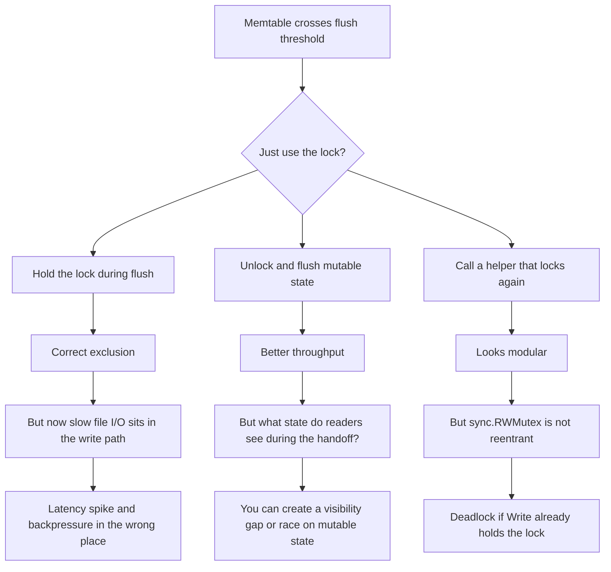
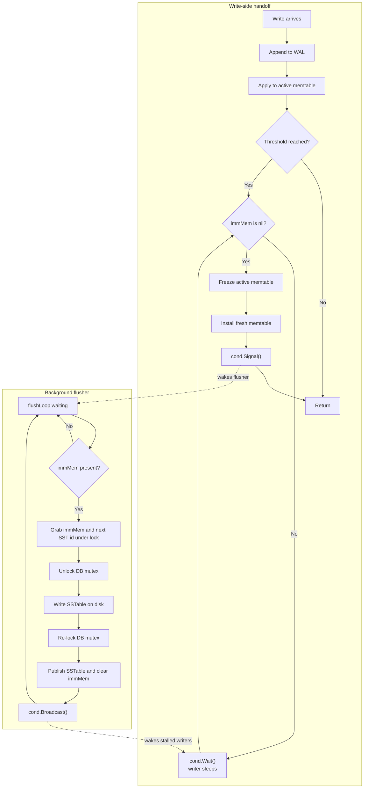

> **TL;DR**: This is a side quest from BeachDB rather than a release post. While wiring the memtable auto-flush path, I ended up learning less about "how to spawn a background goroutine" and more about a deeper pattern: separate state transitions from slow work, make the handoff immutable, and use the right waiting primitive for shared-state predicates. [Code is here](https://github.com/aalhour/beachdb).
{: .prompt-info }

_This one is adjacent to the BeachDB series rather than a milestone post. It is me writing notes to future me while the concurrency pattern is still fresh._

---

## The interesting part was not the flush

On the surface, the BeachDB auto-flush milestone looked like a storage-engine task.

The memtable fills up. It gets written into an SSTable. A background goroutine does the disk work so `Write()` does not sit around waiting for file I/O. Very normal. Very LSM.

But the part that taught me something was not the file writing itself.

The interesting part was the coordination problem hiding inside it:

- writers need to keep moving
- readers must not lose visibility of recently-written state
- the flush path is slow enough that it has to happen off the hot path
- shutdown has to drain background work cleanly

That combination turns out to be a really good little lesson in Go concurrency.

The concrete BeachDB version of the problem is "active memtable becomes immutable memtable, then a background goroutine flushes it to an SSTable." But the shape is more general than databases. It shows up any time a fast path needs to hand work to a slow path without making the system lie about what state is visible.

## The thing a lock solves, and the thing it does not

The first lesson I want future me to remember is this:

> A mutex answers "who may touch this state right now?" It does **not** automatically answer "where does the old state live while slow work continues?" or "how should a goroutine sleep until a shared predicate becomes true?"
{: .prompt-tip }

I ran into this pretty directly while sketching the flush path.

If I only think in terms of locking, I fall into one of three bad shapes:



That was the mental shift for me. The problem was not "protect a critical section." The problem was "define a protocol for moving state across phases."

That protocol needed more than exclusion.

It needed:

1. a way to preserve the old visible state while slow work happens
2. a way to let writers continue on fresh state
3. a way to put writers to sleep when the handoff slot is full
4. a way to wake them up when the shared condition changes

Locking is necessary for that, but it is not the whole story.

## The actual pattern: freeze -> hand off -> publish

The design BeachDB settled on is the small LevelDB-ish shape: one active memtable, one immutable memtable slot, one background flush goroutine, and a `sync.Cond` for coordination.[^2][^3]

The key idea is that the concurrency boundary is not the goroutine. It is the **state transition**.

The active memtable does not get flushed while still being the live mutable thing. It is first frozen, moved into an immutable slot, and only then handed to the background worker. That makes the old state safe to read while the slow path is doing I/O, and it lets a fresh memtable take over for new writes immediately.



That flow diagram is the main lesson I wanted to extract for myself.

Not "use goroutines."

Not "use a mutex."

Use **phase boundaries**:

- mutable
- frozen but still visible
- durable and published

Once the phases are explicit, the rest of the concurrency story gets a lot less mysterious.

Here is the writer-side handoff in the actual BeachDB code. This is the piece that made the pattern click for me:

```go
// Auto-flush if memtable exceeds the configured threshold.
if db.memtableFlushSize > 0 && db.mem.Size() >= db.memtableFlushSize {
    for db.immMem != nil {
        db.cond.Wait()
        if db.closed {
            return ErrDBClosed
        }
    }

    // Swap: active memtable becomes immutable, fresh one takes over.
    db.immMem = db.mem
    db.mem = memtable.NewSkipList()

    // Wake the flush goroutine.
    db.cond.Signal()
}
```

What I like about this snippet is how little it is doing. The writer is not "performing a flush." It is just:

- checking whether the handoff slot is available
- freezing old state
- installing fresh state
- waking the goroutine that owns the slow path

That is a much cleaner division of responsibilities than "writer notices pressure, so writer also does disk work."

## Immutability is not style here, it is synchronization

Before this milestone, I mostly thought of immutability as a nice property. Helpful. Clean. Easier to reason about.

In this design, it is much stronger than that.

The immutable memtable is what makes the handoff work at all.

If I take the active memtable, freeze it, and promise never to mutate it again, then three good things happen immediately:

- the flush goroutine can iterate it without worrying about concurrent writes
- readers can still consult it while the SSTable is being built
- the write path can switch to a fresh mutable memtable without copying data around

That is the pattern I want to keep in my head: **immutability is often the cheapest synchronization primitive you can buy**.

It reduces the amount of time the lock has to cover, because the lock only has to protect the transition into the immutable phase and the later publication of the durable result. The long middle part, the file I/O, happens outside the lock because the thing being written is now stable.

This was one of the big "oh" moments for me. The lock does not make the slow work safe. The phase transition makes the slow work safe.

## Why `sync.Cond` fit better than channels here

The other lesson I want to keep is that "Go concurrency" is not shorthand for "use channels everywhere."

Channels are great when ownership is moving through a pipeline. A worker pool, a stream of jobs, a fan-out/fan-in setup, a request/response handoff. Those all map pretty naturally to channels.

The auto-flush problem is a little different. The question is not "who receives the next item?" The question is:

> Is the immutable slot free yet?

That is a shared-state predicate.

`sync.Cond` is built for shared-state predicates.

When a writer finds `immMem != nil`, it does not need a value. It needs to sleep until that predicate changes. `cond.Wait()` does exactly the right thing: atomically release the write lock, sleep, wake up when signaled, reacquire the write lock, and re-check the predicate.

That last part matters a lot. With a condition variable, the sleep is tied to the lock protecting the state. That is the real win.

I found it useful to phrase it like this:

- the mutex protects the state
- the condition variable protects the wait

BeachDB keeps an `RWMutex` so readers can still use `RLock()`, but wires `sync.Cond` to the write side only via `sync.NewCond(&db.mu)`. That felt odd the first time I wrote it down, but it is perfectly valid because `sync.RWMutex` implements the `Locker` interface through `Lock()` and `Unlock()`.[^4]

The flusher side is where that discipline pays off:

```go
for {
    for db.immMem == nil && !db.closed {
        db.cond.Wait()
    }
    if db.closed {
        return
    }

    imm := db.immMem
    sstPath := db.nextSSTPath()
    db.nextSSTID++

    db.mu.Unlock()
    newSSTableReader, err := writeSSTable(sstPath, imm)
    db.mu.Lock()

    if err != nil {
        db.flushErr = err
    } else {
        db.ssts = append(db.ssts, newSSTableReader)
        db.immMem = nil
    }

    db.cond.Broadcast()
}
```

This is the exact rhythm I want to remember:

1. wait under the lock
2. capture the state transition under the lock
3. do slow work without the lock
4. publish the result under the lock
5. wake anybody waiting on the shared predicate

That rhythm feels much closer to "concurrency as protocol" than "concurrency as primitive."

The shape ended up being:

- readers: `RLock()` and never touch the condvar
- writers: `Lock()` plus `cond.Wait()` / `cond.Signal()`
- flush goroutine: `Lock()` to inspect or publish, unlock during I/O, then `cond.Broadcast()` when the slot clears

That is a much more precise division of labor than "everyone grabs the same lock and hopes for the best."

## Read visibility is part of the concurrency design

Another thing this milestone drove home: a concurrent design is not done once writes are synchronized. The read path needs a story too.

In this case, the story is:

1. check the active memtable
2. then check the immutable memtable, if one exists
3. then check published SSTables newest-first

That middle step is the important one. Without it, the system would have a correctness window where recently-written data disappears from reads after the memtable swap but before the SSTable is published.

That is exactly the sort of bug that can slip by if I think about concurrency only in terms of "did I lock correctly?"

The real question is broader:

> During a handoff, what state is visible, and in what order should it shadow older state?

That is one of the reasons I like this pattern so much. It forces the visibility model into the design instead of leaving it as an emergent property.

The read path is short, but it carries an important correctness promise:

```go
// 1. Check the active memtable.
value, found := db.mem.Get(key, db.seqno)
if found {
    if value == nil {
        return nil, ErrKeyNotFound
    }
    return value, nil
}

// 2. Check the immutable memtable (non-nil during flush).
if db.immMem != nil {
    value, found = db.immMem.Get(key, db.seqno)
    if found {
        if value == nil {
            return nil, ErrKeyNotFound
        }
        return value, nil
    }
}
```

This is why locking alone was never the whole story. Even if the writes were perfectly serialized, the system would still be wrong if the read path had no notion of "state currently in transit."

## "Do not hold the lock during slow work" is true, but incomplete

I already knew the slogan version of this before BeachDB:

> Don't hold a lock while doing slow I/O.

Still true. Still good advice. But this project made me see the missing half:

> You can only drop the lock safely if the thing you handed off has a stable meaning without the lock.

That was the subtle part.

Dropping the lock is not automatically correct. It becomes correct because the flush goroutine is operating on a frozen memtable, not on state that other goroutines might still mutate.

That feels like a better mental model than the slogan alone. The rule is not "always unlock before slow work." The rule is "make the handoff stable enough that unlocking before slow work is safe."

## Shutdown is part of the pattern, not cleanup after it

Another thing I do not want future me to forget: background goroutines are not "done" until shutdown has a real protocol.

In BeachDB, `Close()` has to:

- mark the DB as closed
- wake the flush goroutine so it can observe shutdown
- wait for the goroutine to exit
- only then clean up the readers and WAL writer

And the wait has to happen **outside** the lock, because the flush goroutine may need that same lock to finish publishing or exiting cleanly.

That feels obvious once you have seen it. It was not obvious before I had to think through the deadlock.

This was a good reminder that graceful shutdown is not a boring epilogue. It is part of the concurrency contract.

## What I want future me to remember

If I come back to this post six months from now, these are the points I want to recover quickly:

- A mutex solves mutual exclusion, not the whole handoff protocol.
- If slow work sits in the hot path, the real fix is often a state transition, not a cleverer lock.
- Immutability is a synchronization boundary, not just a stylistic preference.
- `sync.Cond` is a very good fit when the thing I am waiting on is a shared-state predicate.
- Read visibility has to be designed explicitly during background handoffs.
- Unlocking during slow work is only correct if the handed-off state is frozen and self-consistent.
- Shutdown and draining are part of the concurrency pattern, not afterthoughts.

That is the main thing BeachDB taught me here. The concurrency pattern in the flush path is not really about flushing. It is about how to make a fast mutable front door cooperate with a slow background worker without losing correctness, visibility, or your sanity.

And I suspect I am going to keep seeing that shape everywhere now.

## References

[^2]: BeachDB implementation: [`engine/db.go`](https://github.com/aalhour/beachdb/blob/main/engine/db.go)
[^3]: BeachDB tests that exercise the flush and visibility invariants: [`engine/db_flush_test.go`](https://github.com/aalhour/beachdb/blob/main/engine/db_flush_test.go)
[^4]: Go `sync` package docs: [pkg.go.dev/sync](https://pkg.go.dev/sync)
[^5]: LevelDB references that were especially useful here: [implementation overview](https://github.com/google/leveldb/blob/main/doc/impl.md) and [`db/db_impl.cc`](https://github.com/google/leveldb/blob/main/db/db_impl.cc)
[^6]: Pebble references: [`db.go`](https://github.com/cockroachdb/pebble/blob/master/db.go) and [`compaction.go`](https://github.com/cockroachdb/pebble/blob/master/compaction.go)
[^7]: RocksDB references: [`db/db_impl/db_impl_write.cc`](https://github.com/facebook/rocksdb/blob/main/db/db_impl/db_impl_write.cc) and [`memtable_list.h`](https://github.com/facebook/rocksdb/blob/main/db/memtable_list.h)
[^8]: BadgerDB references: [`db.go`](https://github.com/dgraph-io/badger/blob/main/db.go) and [`memtable.go`](https://github.com/dgraph-io/badger/blob/main/memtable.go)
