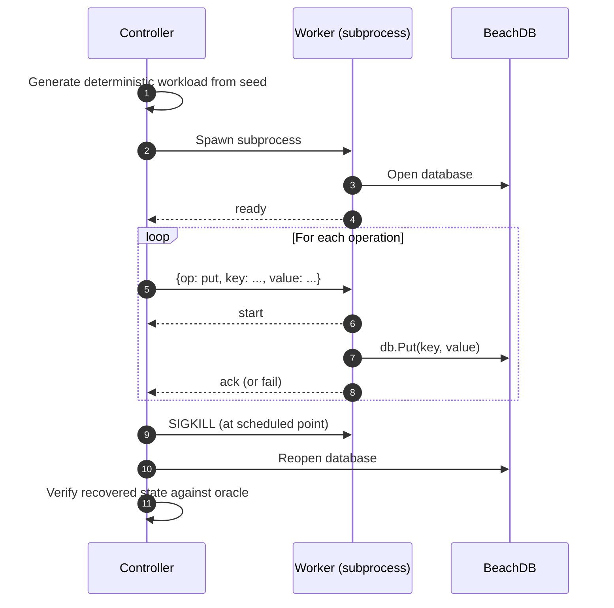

> **TL;DR**: BeachDB v0.0.4 ships a controller/worker crash harness and an internal failpoint framework. Instead of "spawn a writer and SIGKILL it randomly," the harness now pre-generates a deterministic workload, feeds operations one at a time over a protocol, kills the worker at controlled points, and verifies recovered state against an oracle. I also wired seven failpoints into the engine's WAL and flush paths so I can simulate crashes and inject faults at exact internal boundaries. [Code is here](https://github.com/aalhour/beachdb).
{: .prompt-info }

_This is part of an ongoing series — see all posts tagged [#beachdb](/tags/beachdb/)._

---

## The old crash test was a blunt instrument

BeachDB has had crash testing since [v0.0.1](). The original setup was simple: spawn a writer subprocess that writes keys in a loop, wait a random number of milliseconds, `kill -9` the process, reopen the database, check what survived.

That was fine for the "does the WAL actually work?" question. It caught real bugs. It gave me confidence that acknowledged writes survive process death.

But it had problems I kept bumping into:

- **Non-deterministic.** Random kill timing meant a failing run was hard to reproduce. "It failed once at cycle 37" is not a debugging strategy.
- **Coarse verification.** The orchestrator knew which keys the writer _claimed_ it committed, but the protocol for communicating that was a scratch file with newline-delimited keys. No notion of "acknowledged vs. in-flight." No way to distinguish "this key was lost" from "this key was never committed in the first place."
- **No internal visibility.** The kill happened from the outside. I had no way to say "crash right after the WAL fsync but before the memtable apply" or "inject an I/O error during SSTable write." The only tool was a wall clock and a signal.

The deeper I got into the SSTable flush path, the more I wanted a crash test that could be precise about _where_ the crash happens, not just _when_.

## What I actually wanted

The question I kept asking myself was: what would make me trust the durability story more?

Not "more random kills." I already had that. What I wanted was:

1. A deterministic workload I can replay exactly.
2. A protocol where the harness knows, for each operation, whether the worker acknowledged it before death.
3. The ability to crash or inject faults at specific internal engine boundaries, not just random wall-clock moments.
4. An artifact from each run that I can inspect, replay, and diff.

That is four different problems. The first three are about the harness architecture. The fourth is about making failure reproducible as an artifact, not just a log line.

## The new architecture: controller and worker

The rewrite splits the crash harness into two processes with clear roles.



The **controller** owns the workload, the kill schedule, and the verification oracle. It never touches BeachDB directly except to reopen after a kill.

The **worker** is a thin subprocess that receives one operation at a time on stdin, calls the BeachDB API, and emits lifecycle events on stdout: `ready`, `start`, `ack`, `fail`.

The protocol between them is NDJSON with base64-encoded keys and values, so binary payloads survive the round trip without text parsing issues.

### Why one operation at a time?

The old writer did its own key generation in a loop. That meant the controller had no idea which operation was in-flight when the kill landed. The new protocol is deliberately slow: one op, one ack, then the next op. That gives the controller a precise view of the commit frontier at the moment of death.

The cost is throughput. The benefit is that I know exactly what was acknowledged and what was not. For a crash harness, that trade is obvious.

### The durability contract

The worker emits four lifecycle events:

- `ready` — database is open
- `start` — about to execute the operation
- `ack` — the operation succeeded (the DB call returned nil)
- `fail` — the operation returned an error

The controller treats these as:

- **acked operations**: required after recovery. If the DB said "OK," the data must be there.
- **the single started-but-not-acked operation**: indeterminate. The DB may or may not have committed it before death. Both outcomes are acceptable.
- **never-started operations**: irrelevant to this cycle.

That three-way split is the real upgrade over the old harness. The old version had "committed" and "maybe committed." The new version has a clean contract where exactly one operation is allowed to be ambiguous.

## Deterministic workloads and replayable artifacts

Every run starts with a seed. The seed determines the full workload: which keys, which values, which operations, in what order. The kill schedule is also derived from the seed.

That means if a run fails, I can replay it:

```bash
./bin/crash replay \
  --artifact=/tmp/beachdb-crash-artifacts/crash-20260419T213015.123Z.json \
  --dbdir=/tmp/beachdb-crash-replay-db
```

The artifact JSON contains:

- the run configuration and seed
- the full generated workload
- the ordered stream of worker events
- per-cycle metadata and verification results
- the first verification failure, if any

This is the part that would have saved me hours during the SSTable milestone. Instead of "it failed once and I cannot reproduce it," I get a file I can hand to someone else and say "run this."

## Failpoints: crashing at exact internal boundaries

The harness improvements are useful, but they still crash from the outside. The worker process dies wherever the scheduler happens to land. That is realistic but imprecise.

What I really wanted was the ability to say: "crash right after the WAL fsync succeeds but before the memtable is updated" or "make the SSTable write return an I/O error."

That is what the failpoint framework does.

### The idea

The concept is old. FreeBSD has a failpoint framework. TiKV uses `fail_point!` macros. etcd uses `gofail`. CockroachDB has its own variant. The common shape is:

1. place named hook points in production code paths
2. leave them dormant by default
3. activate them from tests via environment variables or a runtime API
4. when armed, they either crash the process or return a synthetic error

BeachDB's version lives in `internal/crashhook` and has two primitives:

- `CrashIfArmed(point)` — if the named point is armed, call `os.Exit(7)` immediately
- `MaybeFault(point)` — if the named point is armed, return a synthetic error

Both are activated by environment variables that the controller passes to the worker subprocess. In normal operation, they are completely inert.

### The hook sites

There are seven failpoints wired into the engine right now, and every one is marked with a `// FAILPOINT:` comment so I can find them all with one grep:

```bash
$ grep -rn "// FAILPOINT:" engine/
engine/db.go:191:  // FAILPOINT: wal_after_append
engine/db.go:411:  // FAILPOINT: wal_sync_error
engine/db.go:420:  // FAILPOINT: wal_after_sync
engine/db.go:647:  // FAILPOINT: sst_publish_error
engine/db.go:656:  // FAILPOINT: flush_after_publish
engine/db.go:671:  // FAILPOINT: sst_write_error
engine/db.go:719:  // FAILPOINT: flush_after_file_sync
```

These cover the critical boundaries in the write and flush paths:

**Crash points** (simulate process death):
- `wal_after_append` — after the WAL append succeeds but before fsync
- `wal_after_sync` — after the WAL fsync boundary
- `flush_after_file_sync` — after the SSTable file and directory are durable on disk
- `flush_after_publish` — after the SSTable reader is published into the engine's in-memory state

**Fault points** (inject errors):
- `wal_sync_error` — force the WAL fsync to fail
- `sst_write_error` — force the SSTable write to fail before touching the filesystem
- `sst_publish_error` — force the publish step to fail after the file is already on disk

Each one tests a different invariant. For example, `wal_after_append` answers: "if the process dies after the WAL append but before fsync, is the write correctly treated as uncommitted?" And `sst_publish_error` answers: "if the SSTable file is durable but the engine crashes before updating its in-memory state, does reopen recover correctly?"

### What a failpoint looks like in the code

A crash hook:

```go
// FAILPOINT: wal_after_append
crashhook.CrashIfArmed(crashhook.PointWALAfterAppend)
```

A fault hook:

```go
// FAILPOINT: wal_sync_error
if err := crashhook.MaybeFault(crashhook.FaultWALSyncError); err != nil {
    return fmt.Errorf("beachdb: syncing WAL: %w", err)
}
```

That is the entire footprint in the engine code. One comment, one call. The `// FAILPOINT:` tag is a project convention so that every hook site is discoverable with a single grep.

## The verification oracle

The last piece is the oracle that runs after every crash/reopen cycle.

The oracle maintains a model of what the database _should_ contain based on the stream of `ack` events. After reopening, it reads every key from the database and checks:

1. every acked key must be present with its expected value
2. the single in-flight key (started but not acked) is allowed to be present or absent
3. no key that was never started should appear with a value it was never given

That is a reference-model verification, the same pattern BeachDB already uses in `internal/testutil.Model` for unit tests, but applied across process boundaries and crash events.

## Running it

A short smoke run:

```bash
make crash-check
```

A longer local run with custom parameters:

```bash
./bin/crash run \
  --dbdir=/tmp/beachdb-crash-db \
  --artifact-dir=/tmp/beachdb-crash-artifacts \
  --cycles=500 \
  --seed=42 \
  --ops=1000
```

Replaying a failure:

```bash
./bin/crash replay \
  --artifact=/tmp/beachdb-crash-artifacts/crash-20260419T213015.123Z.json \
  --dbdir=/tmp/beachdb-crash-replay-db
```

## What I learned

The biggest lesson was not about crash testing specifically. It was about the gap between "tests pass" and "I trust this."

The old crash harness made tests pass. The new one lets me make specific claims about specific boundaries and verify them deterministically. That is a different kind of confidence.

The failpoint framework was the piece that made the difference. Once I could say "crash here, at this exact internal boundary," the durability story stopped being "I wrote a lot of tests and they're green" and started being "I can tell you exactly what happens if the process dies between the WAL fsync and the memtable apply, and here is the artifact that proves it."

That is the kind of evidence I want from a storage engine, even a toy one.

## Where do we go from here?

The next milestone is **Manifest**.

Right now BeachDB discovers `*.sst` files at startup by scanning the directory. A manifest records which SSTables belong to the current database view, gives WAL lifecycle a clean reference point, and becomes the metadata spine that compaction needs.

After that: merge iteration, compaction, and eventually the parts of the engine that turn "a bunch of sorted files" into "a coherent version history."

Until we meet again.

Adios! ✌🏼

---

## Notes & references

[^1]: BeachDB crash harness implementation: [`cmd/crash/`](https://github.com/aalhour/beachdb/tree/main/cmd/crash)
[^2]: BeachDB failpoint framework: [`internal/crashhook/crashhook.go`](https://github.com/aalhour/beachdb/blob/main/internal/crashhook/crashhook.go)
[^3]: TiKV's fail-rs crate, the Rust failpoint library: [github.com/tikv/fail-rs](https://github.com/tikv/fail-rs)
[^4]: etcd's gofail, the Go failpoint library that inspired BeachDB's approach: [github.com/etcd-io/gofail](https://github.com/etcd-io/gofail)
[^5]: TiDB's failpoint package for Go: [github.com/pingcap/failpoint](https://github.com/pingcap/failpoint)
[^6]: FreeBSD's failpoint framework, the original: [FreeBSD fail(9) man page](https://man.freebsd.org/cgi/man.cgi?query=fail&sektion=9)
