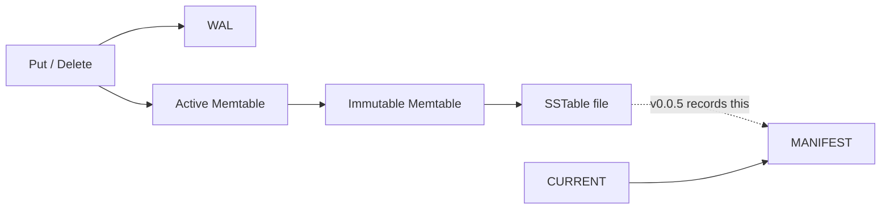
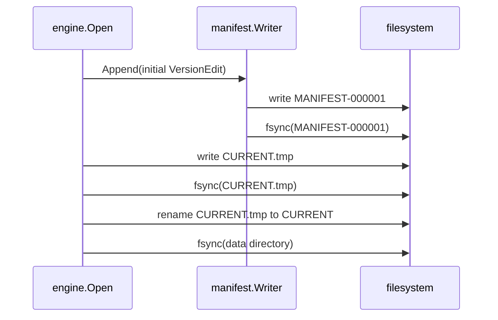
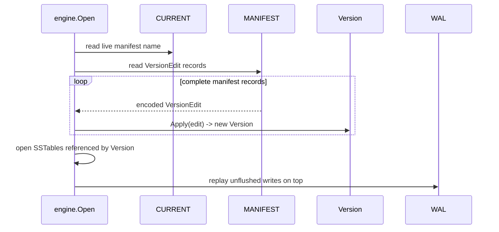
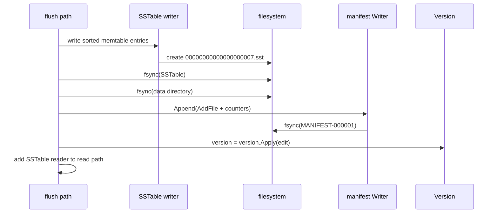

_This is part of an ongoing series — see all posts tagged [#beachdb](/tags/beachdb/)._

---

## My files were correct; my database was still broken

After the SSTable milestone, BeachDB could write real database files. A full memtable became an immutable sorted file on disk, the engine could reopen that file, and reads could search through it. That felt like a big step because it was one: the disk plane finally existed.

But there was still an awkward question hiding under the floorboards:

> How does the database know which SSTable files count?
{: .prompt-tip }

Before this milestone, the answer was basically: scan the directory, find every `*.sst` file, sort them by file number, and open them.

That is fine until you remember that files can exist for reasons other than "this file is part of the current database state." A process can crash after creating an SSTable but before publishing it. A future compaction can leave old files behind until cleanup runs. A human can copy a file into the directory because humans are entropy with keyboards.

At that point, "there is an `.sst` file on disk" is not enough information. The file might be data. It might be garbage. It might be a half-finished artifact from a failed flush.

The database needs durable metadata that says: these files belong to the current state.

That metadata is the manifest.

## A quick recap

BeachDB already had the WAL, memtables, SSTables, and a crash harness. That gave the engine durable writes, in-memory state, immutable files, and better ways to test crash boundaries.

What it did not have was durable ownership metadata for flushed files. SSTables existed in `v0.0.3`, but the engine still needed a way to distinguish a valid database file from an orphan after restart.

The gap looked like this:



## So, what is a manifest?

A manifest is an append-only log of metadata changes.

The WAL answers: "Which writes happened recently and may need to be replayed?"

The manifest answers: "Which SSTables exist, at which level, with which key ranges, and what are the current counters?"

Together, they rebuild the database on startup:

```text
Manifest -> flushed file structure
WAL      -> unflushed recent writes
```

BeachDB's manifest has three pieces:

1. `CURRENT`: a tiny text file containing the name of the live manifest.
2. `MANIFEST-NNNNNN`: an append-only record log of metadata edits.
3. `Version`: the in-memory snapshot rebuilt by replaying those edits.

The implementation lives in `internal/manifest`; the engine wires it into startup and flush publishing.[^2]

On disk, the directory now looks like this:

```text
data/
├── CURRENT
├── MANIFEST-000001
├── beachdb.wal
├── 00000000000000000001.sst
├── 00000000000000000002.sst
└── ...
```

`CURRENT` contains one line:

```text
MANIFEST-000001
```

That indirection is not there for decoration. In the future, BeachDB can rotate the manifest by writing a fresh compacted manifest file and atomically swinging `CURRENT` to point at it. `v1` does not rotate yet, but the recovery path needs this pointer from day one. Retrofitting it later would be exactly the sort of metadata migration that ruins a weekend.

All flushed SSTables go into level 0 for now. Compaction is not here yet. But the manifest already records a `level` field because compaction will eventually be expressed as a metadata edit: delete these files from L0, add this file to L1.

## Seeing it with `manifest_dump`

As usual, I do not trust a format until I can dump it.

`v0.0.5` adds `manifest_dump`, the metadata sibling of `wal_dump` and `sst_dump`.[^3] It reads `CURRENT`, opens the live manifest, prints every `VersionEdit`, applies the edits in order, and then prints the reconstructed `Version`.

Here is sample output:

```text
$ manifest_dump /tmp/beachdb-example-manifest
Manifest: MANIFEST-000001
Path:     /tmp/beachdb-example-manifest/MANIFEST-000001

Edit #0:
  next_file_id:  1
  last_sequence: 0
  log_number:    0
Edit #1:
  next_file_id:  2
  last_sequence: 2
  add_file:    level=0 id=1 size=170 smallest="apple/1/Put" largest="apricot/2/Put"
Edit #2:
  next_file_id:  3
  last_sequence: 4
  add_file:    level=0 id=2 size=178 smallest="banana/3/Put" largest="blueberry/4/Put"

Current Version:
  Level 0: 2 files (348 bytes total)
    [1] apple..apricot (170 bytes)
    [2] banana..blueberry (178 bytes)
```

The useful part is not just the final state. The tool shows how the engine got there: bootstrap counters, add file 1, add file 2, rebuild the current version.

If the manifest is corrupt, the tool follows the same policy as the engine: print what was valid, report the edit where replay failed, and exit non-zero.

## The metadata edit: `VersionEdit`

The unit of change in the manifest is a `VersionEdit`.

It is the metadata cousin of a write batch. A batch says: put this key, delete that key. A `VersionEdit` says: add this SSTable, delete that SSTable, advance this counter.

In `v1`, an edit can carry:

- `AddFile`: level, file ID, file size, smallest key, largest key
- `DeleteFile`: level and file ID
- `NextFileID`: the next SSTable file number to allocate
- `LastSequence`: the highest database sequence number seen so far
- `LogNumber`: the WAL number associated with the edit

Every field is optional. That matters because most metadata changes are small. A flush usually adds one file and advances counters. A future compaction will delete a few files and add a few files. There is no reason to rewrite a full manifest snapshot every time one file enters the database.

On disk, a `VersionEdit` uses a small TLV encoding: tag, then value. The exact byte layout lives in the format spec.[^1] The important part for this post is the contract:

- encode only fields that are set
- write integers big-endian, so hex dumps stay readable
- emit fields deterministically, so the same edit produces the same bytes
- put counters before file deltas

That last bit follows the same broad convention LevelDB uses.[^4]

The decoder hard-errors on unknown tags in `v1`. Skipping unknown fields sounds nice, but it requires either a length prefix on every tag or a per-tag skip table. I do not need that machinery yet. LevelDB and RocksDB also treat unknown version-edit tags as hard errors in their current decoders.[^4][^6] When a real manifest schema change lands, the manifest format version can bump and older readers can reject it cleanly.

No silent improvisation. Storage formats should not guess.

## Reusing the record layer

The manifest is a different logical log from the WAL, but the record framing problem is identical:

- fixed magic bytes
- format version
- record type
- payload length
- payload checksum
- opaque payload bytes

So I pulled that framing into a shared `internal/record` package. The WAL uses `BEACHWAL` as its magic. The manifest uses `BEACHMAN`. The rest of the envelope is the same.

```text
[magic:8][version:1][type:1][length:4][checksum:4][payload:N]
```

The header is 18 bytes total. The payload is whatever the caller owns:

| File | Magic | Payload |
|------|-------|---------|
| WAL | `BEACHWAL` | encoded `Batch` |
| MANIFEST | `BEACHMAN` | encoded `VersionEdit` |

That separation is important. The framing layer knows how to reject bad magic, unsupported versions, unsupported record types, oversized payloads, truncated records, and checksum mismatches. It does not know what a batch is. It does not know what a `VersionEdit` is.

Semantic meaning lives inside the payload. Record safety lives around it.

This mirrors the general direction of LevelDB/RocksDB reusing log readers and writers for both WAL-ish and manifest-ish streams, and Pebble's explicit shared record package made the idea feel especially natural in Go.[^5][^7]

It also means one set of record tests and fuzz targets protects both logs. The tradeoff is that a record-layer bug can affect both logs, so the abstraction has to stay small and heavily tested.

## Opening a fresh database

When BeachDB opens an empty directory, there is no `CURRENT` file. That means there is no committed manifest yet, so the engine bootstraps one.

The fresh path is:

1. Create an empty in-memory `Version`.
2. Pick the next available manifest filename, usually `MANIFEST-000001`.
3. Append one initial `VersionEdit` with:
   - `NextFileID = 1`
   - `LastSequence = 0`
   - `LogNumber = 0`
4. Sync the manifest file.
5. Atomically install `CURRENT`.

The `CURRENT` install uses the usual crash-safe dance:

```text
write CURRENT.tmp
fsync CURRENT.tmp
rename CURRENT.tmp -> CURRENT
fsync parent directory
```

The rename is atomic. The directory `fsync` makes the rename durable. Without that last syscall, the rename can be visible to the running process but disappear after a crash. I have already been bitten by directory `fsync` once; I am trying not to make it a recurring character.



`CURRENT` is the commit point. If the process crashes before `CURRENT` is installed, the directory still looks fresh on the next open. If a half-created `MANIFEST` file is left behind without `CURRENT` pointing to it, BeachDB treats it as an orphan manifest and bootstraps a new one using the next available manifest ID.

That last detail matters. Reusing `MANIFEST-000001` with append mode after a failed bootstrap would be a lovely way to stitch garbage bytes and valid metadata into one cursed file. So bootstrap avoids name collisions with orphan manifests.

## Reopening an existing database

On an existing database, startup has a different job.

BeachDB reads `CURRENT`, opens the named manifest, and replays every complete manifest record into a fresh `Version`.



The order matters:

1. Rebuild flushed SSTable state from the manifest.
2. Open exactly those SSTables.
3. Replay the WAL on top.

The manifest gives the engine the durable file set. The WAL restores writes that happened after the last flush.

If the manifest ends with a truncated trailing record, recovery treats it as a crash during append. The reader stops at the last valid record and truncates the manifest back to that boundary. That is safe because `manifest.Writer.Append` syncs the file before the edit counts as durable.

But not every problem is recoverable:

- Bad magic: hard error.
- Unsupported version: hard error.
- Checksum mismatch: hard error.
- Unknown `VersionEdit` tag: hard error.
- Manifest references a missing SSTable: hard error.

That last case is worth calling out. A truncated WAL tail usually means the process died before acknowledging a write. Fine. Discard it.

A missing SSTable promised by the manifest is different. The flush path syncs the SSTable before syncing the manifest edit. If the manifest says the file exists and the file is gone, something broke the database contract. Maybe a bug. Maybe someone deleted files manually. Either way, continuing would hide corruption.

## Orphans: files outside the manifest

The flip side is an SSTable that exists on disk but is not referenced by the manifest.

That file is an orphan.

The most common path is:

1. Flush writes a new SSTable.
2. Flush syncs the SSTable file.
3. Flush syncs the parent directory.
4. Process dies before the manifest edit is appended and synced.

After restart, the file exists, but the manifest never promised it. So the database ignores it. In `v0.0.5`, startup also performs best-effort cleanup for canonical SSTable filenames that are not referenced by the recovered `Version`.

The rule is simple:

> Referenced files are required. Unreferenced files are debris.
{: .prompt-info }

If a file is referenced by the manifest and missing on disk, startup fails. If a file exists on disk and is not referenced by the manifest, startup can delete it.

This gives BeachDB an actual ownership model. The directory can contain debris. The database state is the manifest plus WAL, not a directory scan of whatever filenames happen to be nearby.

## The flush path

Now we can talk about the runtime path that makes the manifest matter.

When a memtable flush completes, BeachDB has a new SSTable reader plus the metadata needed to describe the file:

- file ID
- file size
- smallest internal key
- largest internal key
- level 0

The publish order is:

```text
write SSTable
fsync SSTable
fsync data directory
append manifest VersionEdit
fsync manifest
apply edit to in-memory Version
install SSTable reader
```

Never reverse the SSTable sync and manifest sync.

If the manifest is synced first, it can promise a file that might not be durable. That is the bad failure mode: recovery expects a file that may have never made it to stable storage.

If the SSTable is synced first and the process dies before the manifest edit, the file becomes an orphan. That is safe. Wasteful, but safe.



`Version.Apply` is immutable. It returns a new `Version` instead of mutating the old one in place.

That is slightly more machinery than BeachDB needs today, but it is the right foundation for the next milestone. Once iterators and snapshots exist, a reader may need to hold a stable view of "which files existed when I started." If a flush mutates that version under the reader, congratulations, you have invented a subtle bug with a long tail and terrible manners.

Immutable versions make the future read path less weird.

## Design decisions

There were a few places where I had to choose the small version of a real database idea instead of accidentally building a little museum of database metadata.

### A log of edits, not a full snapshot

The simplest possible manifest would be a full snapshot: serialize the current file set, write it to a temp file, sync it, rename it into place. That is appealing because the recovery path reads one object and is done.

I did not choose that for BeachDB v1.

A log of edits makes each metadata change proportional to the change itself. A flush adds one file, so it writes one `AddFile` edit. A future compaction will delete some files and add some files, so it can write one edit containing exactly that transition. It also gives `manifest_dump` an audit trail: not just "here is the current state," but "here is how the database got here."

That matched the LevelDB/Pebble-style path better than a snapshot-only format.[^4][^7]

### `CURRENT` exists before rotation does

`v1` never rotates the manifest. It could technically hardcode `MANIFEST-000001` and get away with it for now.

I still added `CURRENT`.

The reason is that rotation changes the bootstrap problem. Eventually, BeachDB will want to write a compacted manifest and atomically switch from the old one to the new one. A tiny pointer file is the clean atomic object: write `CURRENT.tmp`, sync it, rename it, sync the directory.

If that indirection is part of the format from day one, recovery always starts the same way. If it is retrofitted later, the database has to support two boot protocols for old and new directories. That sounds like "not today" until it becomes "why is recovery full of archaeology?"

### TLV, but no skip-unknown machinery yet

`VersionEdit` uses tag-value encoding because edits are sparse. A flush edit does not need to write empty delete lists or future compaction fields. It writes the fields it actually sets.

But `v1` does not try to skip unknown tags. That would require every tag to be length-delimited, even fixed-width ones, or a decoder that knows how to skip every future field shape. That is forward-compatibility theater unless there is a real future field to support.

So the rule is stricter and simpler: unknown tag means "this manifest is not for this reader." The format version byte is the escape hatch.

### Manifest sync is not optional

The WAL has configurable sync behavior because write latency is a user-facing tradeoff. The manifest does not get that knob.

Every manifest append is synced. Metadata changes are infrequent compared to user writes, and the manifest entry is the thing that makes a newly flushed SSTable official. If the SSTable is durable but the manifest edit is not, recovery can safely ignore the orphan. If the manifest edit is durable before the SSTable is durable, recovery may believe in a file that never survived.

That is the bad ordering. So the flush path pays the metadata sync cost.

### Missing promised files are corruption

WAL truncation and missing manifest-referenced SSTables are not the same kind of failure.

A truncated WAL tail usually means the process died mid-write. The caller never got success, so recovery can discard the partial record and move on.

A missing SSTable promised by the manifest means something violated the durable file-set contract. The manifest append happens after the SSTable file and parent directory are synced. If that file is gone later, BeachDB should not pretend everything is fine. It should fail loudly.

This is one of those rules that feels harsh until the alternative is silently losing data.

### No rotation in v1

Manifest rotation is real work: write a compact replacement, install it safely, decide what to do with old manifests, and test every crash point in that sequence.

For `v0.0.5`, that is too much scope. The manifest can grow for now. The important thing is that the format already has the pointer file that makes future rotation possible.

The v1 rule is enough: one live manifest, append edits, replay on startup.

## A tiny runnable example

The public example for this milestone writes three small batches, flushes after each one, closes the database, and reopens it.

```go
batches := []map[string]string{
    {"apple": "red", "apricot": "orange"},
    {"banana": "yellow", "blueberry": "blue"},
    {"cherry": "red", "cranberry": "crimson"},
}

for _, batch := range batches {
    for _, k := range sortedKeys(batch) {
        _ = db.Put(ctx, []byte(k), []byte(batch[k]))
    }
    _ = db.Flush()
}
```

After the first session, the database directory contains:

```text
CURRENT
MANIFEST-000001
beachdb.wal
00000000000000000001.sst
00000000000000000002.sst
00000000000000000003.sst
```

On the second session, the engine rebuilds the SSTable inventory from `CURRENT` + `MANIFEST-000001`, opens those three files, and serves the reads from the recovered file set.

The second open does not infer state from every `*.sst` file in the directory. It replays the manifest first, then opens the files that replay names.

## Testing the contract

This milestone touched startup, flushing, file naming, binary encoding, truncation recovery, and corruption handling. So the tests had to cover a few layers.

At the format layer:

- `VersionEdit` round-trips with all fields set
- partial edits round-trip with only some fields set
- empty edits encode/decode cleanly
- multiple added/deleted files work in one edit
- unknown tags hard-error
- random decode inputs do not panic

At the manifest log layer:

- writer appends records and syncs
- reader yields edits in order
- an existing manifest with no `NextFileID` counter is rejected as corrupt
- truncated tails are recoverable
- checksum corruption is fatal
- bad magic is fatal

At the engine layer:

- fresh open creates `CURRENT` and `MANIFEST-000001`
- existing open replays the manifest
- missing manifest promised by `CURRENT` is fatal
- missing SSTable promised by the manifest is fatal
- duplicate `AddFile` is fatal
- orphan `DeleteFile` is tolerated
- flush writes a manifest edit
- `NextFileID` survives restart
- `LastSequence` survives restart
- flushed data survives even if the WAL is removed
- flushed SSTables plus unflushed WAL writes recover together
- orphan SSTables are removed on reopen

That last one is the new behavior I wanted to lock down carefully. The test is:

1. Write a key and flush it to SSTable `1`.
2. Delete the WAL so recovery must come from manifest + SSTable.
3. Plant a junk canonical SSTable file at ID `2`.
4. Reopen.
5. Verify file `2` is removed.
6. Verify the key from SSTable `1` still reads correctly.
7. Flush again and confirm ID `2` can be reused safely.

That is the manifest contract in miniature: referenced files count; orphan files do not.[^1]

## What changed in the engine

Before this milestone, startup inferred state from the filesystem.

After this milestone, startup replays state from logs:

```text
CURRENT -> MANIFEST -> Version -> SSTable readers
WAL     -> active memtable
```

This is a better boundary. The database no longer asks the directory to explain itself. It asks its own metadata.

That also means `db.seqno` and `db.nextSSTID` no longer have to be guessed from whatever files happen to exist. The manifest checkpoints them. That matters a lot for future snapshots and compaction. Sequence numbers going backward after a restart would be one of those bugs that looks harmless until it quietly breaks read semantics.

The manifest is not a flashy milestone. It does not add a new user-facing API. It does not make point reads faster. It does not compact anything.

It makes the engine less naive about its own files.

That is exactly the kind of small, unglamorous metadata layer databases are made of.

## What's next

Next up is the read path: merge iterators across memtables and SSTables, snapshot reads, and range scans.

Right now `Get` can search the active memtable, immutable memtable, and SSTables newest-first. That is enough for point lookups. It is not enough for a real ordered scan across multiple sorted sources, especially once snapshots enter the picture.

The manifest gives the read path a stable file set to stand on. Now the read path has to earn it.

After that: read acceleration, bloom filters, block caching, and then compaction. The manifest will become more interesting when compaction starts producing edits that delete old files and add new ones in one atomic metadata step.

Until we meet again.

Adios! ✌🏼

---

## Notes & references

[^1]: BeachDB manifest format specification: [`docs/formats/manifest.md`](https://github.com/aalhour/beachdb/blob/v0.0.5/docs/formats/manifest.md)
[^2]: BeachDB manifest package: [`internal/manifest`](https://github.com/aalhour/beachdb/tree/v0.0.5/internal/manifest)
[^3]: BeachDB manifest dump tool: [`cmd/manifest_dump`](https://github.com/aalhour/beachdb/tree/v0.0.5/cmd/manifest_dump)
[^4]: LevelDB's `VersionEdit` encoding lives in [`db/version_edit.h`](https://github.com/google/leveldb/blob/main/db/version_edit.h) and [`db/version_edit.cc`](https://github.com/google/leveldb/blob/main/db/version_edit.cc).
[^5]: LevelDB's manifest / version-set logic lives in [`db/version_set.cc`](https://github.com/google/leveldb/blob/main/db/version_set.cc).
[^6]: RocksDB's MANIFEST overview: [github.com/facebook/rocksdb/wiki/MANIFEST](https://github.com/facebook/rocksdb/wiki/MANIFEST)
[^7]: Pebble's manifest implementation is a useful Go reference: [`internal/manifest/version_edit.go`](https://github.com/cockroachdb/pebble/blob/master/internal/manifest/version_edit.go), and its shared record package lives under [`record`](https://github.com/cockroachdb/pebble/tree/master/record).
