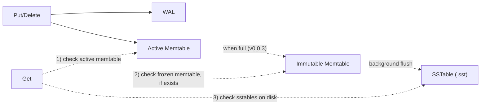
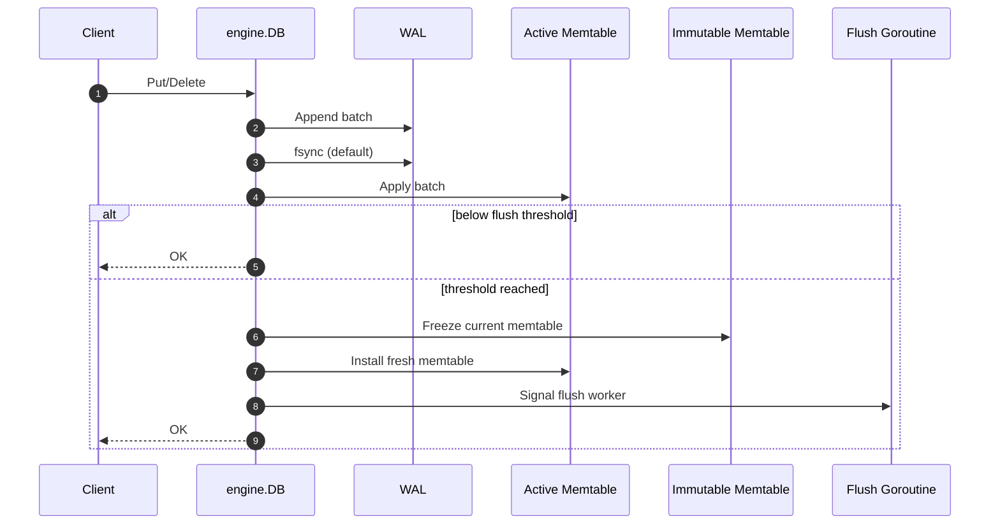
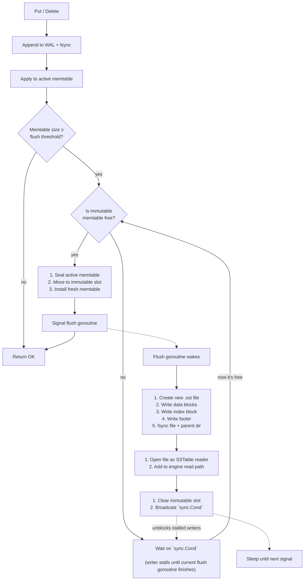
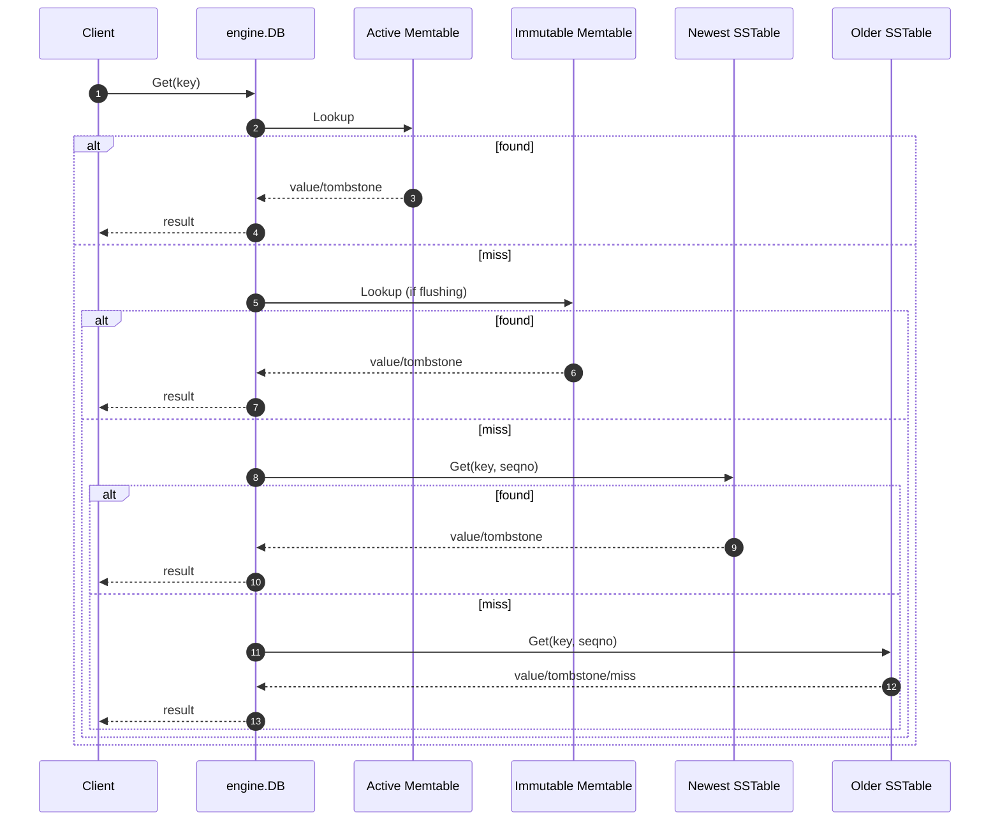

> **TL;DR**: BeachDB v0.0.3 is out, and it ships SSTables v1: immutable sorted files on disk, a real memtable flush path, on-disk reads, and an `sst_dump` tool so I can inspect the bytes instead of trusting vibes. This is the milestone where BeachDB stops being an in-memory engine with a WAL and starts having a real disk plane. [Code is here](https://github.com/aalhour/beachdb/tree/v0.0.3).
{: .prompt-info }

_This is part of an ongoing series — see all posts tagged [#beachdb](/tags/beachdb/)._

---

## The disk plane finally gets real

It has been a while since the last milestone, and most of that time disappeared into the unglamorous but important question of what kind of file format I wanted to commit to. It felt like the moment I moved from memory to disk, every casual design choice started feeling a lot less casual.

[BeachDB v0.0.3](https://github.com/aalhour/beachdb/releases/tag/v0.0.3) is the milestone where the LSM diagram stops bluffing about data on disk.

BeachDB can now flush a full memtable into immutable sorted files on disk, reopen those files, and read through them. Those files have sparse indexes and fixed-size footers, so reads can binary-search candidate blocks instead of scanning the whole file. It writes real database files now.

This post walks through what changed in the engine, what one of those files [looks like on disk](#the-sstable-format), [why the format looks the way it does](#design-notes-five-format-decisions), and how I [convinced myself the bytes were not lying](#testing-or-how-i-convinced-myself-this-isnt-lying).

Before we dig deeper, it's worth reviewing what the project has shipped this far.

## A quick recap

[In the last post](), [v0.0.2](https://github.com/aalhour/beachdb/releases/tag/v0.0.2) shipped the memtable and wired it to the WAL. BeachDB got to a weirdly honest intermediate state that made it look like an in-memory database with a WAL:

- new writes were durable because of the WAL (on disk)
- new writes were readable because of the memtable (in memory)
- but the disk plane itself was still mostly a promise

Crash recovery worked. Tombstones existed. Internal keys existed. The engine could behave like an LSM in memory while still not producing any actual sorted files on disk.

That missing edge looked like this:



Those memtable -> SSTable paths are what this milestone makes real.

The public API did not change. `Put`, `Get`, and `Delete` are the same. What changed is the journey that the data takes after it enters the engine:

```text
WAL -> active memtable -> immutable memtable -> SSTable(s)
```

Before v0.0.3, the memtable was the destination. After v0.0.3, it becomes what it was always supposed to be: a staging area.

If [`v0.0.1`](https://github.com/aalhour/beachdb/releases/tag/v0.0.1) made durability real and [`v0.0.2`](https://github.com/aalhour/beachdb/releases/tag/v0.0.2) made the in-memory shape real, then [`v0.0.3`](https://github.com/aalhour/beachdb/releases/tag/v0.0.3) makes the on-disk state real.

This is point-lookups-through-SSTables, not yet full version-set or compaction machinery. Those parts are still later.

---

## So, what is an SSTable?

The term "SSTable" is short for Sorted String Table. It comes from the Bigtable paper[^1], but the shape escaped into a lot of other systems after that: LevelDB[^3], RocksDB[^4], Pebble[^5], HBase/HFile[^7], Cassandra[^8], and plenty of smaller LSM engines too.

> SSTables are immutable sorted files that storage engines write to disk once in-memory state graduates out of the memtable. They are how "a bunch of writes in memory" turns into durable, searchable on-disk state.
{: .prompt-tip }

In BeachDB, an SSTable is an **immutable sorted file of key-value entries** written from a full memtable (a skiplist) to disk.

It is not a table in the SQL sense. It is not a schema object. It is just a storage-engine file with one job:

- take sorted internal keys from memory
- write them to disk in sorted order
- carry enough structure that a reader can find things without scanning the whole file

They're called tables because they:

- represent key-value pairs as sorted strings lexicographically very well
- have a loose tabular format where every entry is a key followed by a value with some form of sequence number that the database may or may not use to track "versioning": new vs. old entries
- usually come with sparse-indexes either inside the file itself or outside of it that is used to lookup the file offset for given keys which speeds up reads (instead of having to scan the entire file) since they are immutable

If you want the 10,000-ft version of why storage engines end up looking like this, Chapter 3 of Martin Kleppmann's Designing Data Intensive Applications[^2] is still the cleanest guide I know.

### The plain-text version first

Before bytes and checksums, the idea looks like this. Suppose you have the following Go program that uses BeachDB to store some keys and values:

```go
db, err := engine.Open("~/myproject")

if err != nil {
    log.Fatal(err)
}

ctx := context.Background()

_ = db.Put(ctx, []byte("apple"), []byte("red"))
_ = db.Put(ctx, []byte("banana"), []byte("yellow"))
_ = db.Put(ctx, []byte("apple"), []byte("green"))
_ = db.Delete(ctx, []byte("banana"))

_ = db.Close()
```

And suppose that the above program resulted in two flushes to disk, the first two operations would land in a file called `01.sst` and the second two operations would land into a second file called `02.sst`. Then the files would roughly contain the following sorted contents (sorted by key first, sequence number second):

```text
# 000001.sst  (older)
apple@1  Put     = "red"
banana@2 Put     = "yellow"

# 000002.sst  (newer)
apple@3  Put     = "green"
banana@4 Delete  = <tombstone>
```

Now a `Get("apple")` does not mean "open one file." It means:

1. check memory first
2. if memory misses, check the newest SSTable
3. if still missing, keep going backward through older SSTables

So:

- `Get("apple")` returns `"green"` because the newer file (`2.sst`) shadows the older one (`1.sst`)
- `Get("banana")` returns "not found" because the newer tombstone shadows the older put

That is the part I think is easiest to miss when people hear "simple key-value store." Even a tiny LSM-ish engine stops being "one map on disk" pretty quickly. It becomes a few sorted files, ordered newest-to-oldest, plus a couple of rules about shadowing and tombstones.

In BeachDB, a new SSTable appears when the active memtable fills up, gets frozen, and is flushed in the background into the next `.sst` file.

We'll follow that engine path first, then crack the file open in [The SSTable format](#the-sstable-format) — including a real file inspected byte by byte — and close with [why the format looks the way it does](#why-beachdbs-sstable-v1-looks-like-this).

## Write path: same API, different destination

`Put()` and `Delete()` are still boring on purpose, they:

- append the batch to the WAL
- `fsync` the WAL by default
- apply the mutation to the active memtable

The new part is what happens when that memtable stops fitting in memory.

Suppose the DB directory already has:

```text
000000.sst
000001.sst
```

Once the active memtable crosses the flush threshold, the next flush creates `000002.sst`. That is the first real answer to "how are SSTables written?" They are not produced by a separate API. They are produced when a full memtable graduates to disk.

Here is the write path now:



The API stays the same. The destination changes. Memory stops being the destination and becomes a waiting room on the way to disk.

That still does not explain the frozen memtable part, so let's zoom into the flush itself.

## Flush path: how memory becomes a file

The immutable memtable exists for one reason: flushing is slow enough that old visible state needs somewhere to wait while new writes keep moving.

When the active memtable crosses the threshold, the writer and the background flush goroutine coordinate through a single immutable slot and a `sync.Cond`:



That gives BeachDB the classic small-engine shape:

- one active memtable for new writes
- one immutable memtable being flushed
- N immutable SSTables on disk

Suppose the DB directory already contains `000000.sst` and `000001.sst`. The active memtable crosses the threshold and starts flushing into `000002.sst`. While that happens, a new `Put("mango", "...")` lands in the fresh active memtable immediately. Reads can still consult the frozen immutable memtable until `000002.sst` is fully written and published.

In terms of code, that is why [`immMem` on the `DB` struct](https://github.com/aalhour/beachdb/blob/6c48d44b10c00c7a478095a141e1c082ee374f1a/engine/db.go#L47-L48) exists. It is not just a convenience variable. It is how BeachDB keeps old state visible during a flush without blocking the whole write path.

There is one catch: BeachDB only has one immutable slot right now. If another flush threshold is hit before the first flush finishes, writers wait on a `sync.Cond` until the slot clears. That is deliberate. Small story, real behavior.

### Why not flush inline?

Because a flush is real I/O, it constitutes the follwoing:

- creates a new SSTable file
- iterates over the frozen memtable
- writes the data blocks
- writes the index block
- writes the footer
- calls `fsync` on the file
- calls `fsync` on the parent directory
- reopens the file as an SSTable reader and adds it to the engine's struct (so new reads can consult this file if need be)

Doing all of that inline in `Write()` would turn every threshold crossing into "everybody pause while the filesystem has a moment." The background flush keeps the common write path boring and pushes the expensive part out of the hot lane.

### Why this shape looks familiar

LevelDB[^3] is the clearest reference point here: one active memtable, one immutable slot, one background worker, one clean freeze -> flush -> publish story.

Pebble[^5] keeps the same idea but generalizes it into a queue of flushable memtables. Same shape, larger waiting room.

RocksDB[^4] scales the pattern up with more concurrency and more backpressure machinery. Useful as proof that the pattern grows; not something BeachDB needs to copy wholesale yet.

BadgerDB[^6] is the useful contrast. It leans more into channels, but the underlying problem is the same: writers need to keep moving, readers need old state to stay visible, and the handoff to disk needs clear synchronization.

BeachDB takes the small LevelDB-ish path for now: one immutable slot, one flush goroutine, `sync.Cond` for writer stalling, and read visibility preserved while the flush is in flight.

## Read path: now reads can reach disk

Now that the immutable memtable exists for a reason, the read path makes sense.

Before this milestone, a miss in the memtable was basically the end of the road. Now it is just the point where the search drops a level.

### Example #1:

Assume the database directory has the following two SSTable files with two `Put` operations and the key is not in the memtable:

```text
000001.sst  -> apple@1 Put = "red"
000002.sst  -> apple@3 Put = "green"
```

`Get("apple")` returns `"green"` because the newer file shadows the older one.

### Example #2:

Now assume that the two files are slightly different, the older one has a `Put` operation and the newer one has a `Delete`, the key is still not in the memtable:

```text
000001.sst  -> banana@2 Put    = "yellow"
000002.sst  -> banana@4 Delete = tombstone
```

`Get("banana")` returns not found because the newer tombstone (on-disk) wins.

That is the whole rule: **newest visible fact wins, and reads now know how to reach disk.**



The search order is:

1. active memtable
2. immutable memtable, if a flush is in progress
3. SSTables newest-first

That newest-first rule is load-bearing. Newer state shadows older state. Tombstones shadow older puts. The engine stops as soon as it finds the first visible answer.

If you want the inside of one SSTable, the next stop is [The SSTable format](#the-sstable-format).

---

## The SSTable format

So that's the engine story. Now let's look at the file the flush is actually producing.

The formal spec lives in [`docs/formats/sstable.md`](https://github.com/aalhour/beachdb/blob/main/docs/formats/sstable.md), but what follows is the shape of a single SSTable file on-disk:

```text
[data block 0][data block 1]...[data block N][index block][footer]
```

That still hides the important detail, though: a **data block is not one key-value pair**.

Each data block holds **multiple sorted entries** packed together until the block reaches its target size. If the entries are small, one block may hold quite a few of them. If the entries are large, the block may hold only a handful. The block is the unit of storage and checksumming; the entries inside it are the actual key-value records.

In a slightly more expanded view, one SSTable looks like this:

```text
[data block 0: entry, entry, entry, ..., crc32c]
[data block 1: entry, entry, entry, ..., crc32c]
...
[index block: last key of block 0 -> off/size, last key of block 1 -> off/size, ..., crc32c]
[footer]
```

Each data entry (inside a data block) is:

```text
[internal_key_len:4][internal_key_bytes][value_len:4][value_bytes]
```

Each index entry (inside the single pre-footer index block) is:

```text
[last_internal_key_len:4][last_internal_key_bytes][block_offset:8][block_size:4]
```

And the fixed-size footer is:

```text
[magic:8][version:4][index_offset:8][index_size:4][data_block_count:4][entry_count:8][checksum:4]
```

The two rules that matter most are:

- entries are sorted by `(user_key ASC, seqno DESC)`
- the index stores **only the last internal key of each data block**

That second rule is the important one for the read path. The index is sparse: one record per block, not one record per entry. Because the last key is an upper bound for everything inside that block, the reader can construct a synthetic "maximum possible version" for the target user key, binary-search those upper bounds, and jump straight to the first block that could still contain the answer. From there, the on-disk scan stays local instead of wandering through the entire file.

So the index is small, the lookup is logarithmic over blocks, and the on-disk scan stays local. That is the efficiency story in one paragraph.

### A human-reable file example

Suppose the engine writes five entries into a single SSTable with a 60-byte target block size. The entries arrive pre-sorted from the memtable:

```text
apple@1      Put    = "red"
banana@2     Put    = "yellow"
cherry@3     Put    = "dark red"
date@4       Delete = <tombstone>
elderberry@5 Put    = "blue"
```

The writer fills each block until the next entry would push it past 60 bytes, then flushes and starts a new one. Here is what the file looks like laid out section by section:

```text
[ data block 0 ]                    offset=0    size=58
  apple@1      Put    = "red"       (25 bytes)
  banana@2     Put    = "yellow"    (29 bytes)
  ────────────────────────────────────────────────
  data payload                       54 bytes
  crc32c trailer                      4 bytes
  last key: banana@2

[ data block 1 ]                    offset=58   size=56
  cherry@3     Put    = "dark red"  (31 bytes)
  date@4       Delete = <tombstone> (21 bytes)
  ────────────────────────────────────────────────
  data payload                       52 bytes
  crc32c trailer                      4 bytes
  last key: date@4

[ data block 2 ]                    offset=114  size=35
  elderberry@5 Put    = "blue"      (31 bytes)
  ────────────────────────────────────────────────
  data payload                       31 bytes
  crc32c trailer                      4 bytes
  last key: elderberry@5

[ index block ]                     offset=149  size=99
  "banana@2"      -> block_offset=0,   block_size=58
  "date@4"        -> block_offset=58,  block_size=56
  "elderberry@5"  -> block_offset=114, block_size=35
  ────────────────────────────────────────────────
  index payload                      95 bytes
  crc32c trailer                      4 bytes

[ footer ]                          offset=248  size=40
  magic            = "BEACHSST"
  version          = 1
  index_offset     = 149
  index_size       = 99
  data_block_count = 3
  entry_count      = 5
  checksum         = <crc32c of above 36 bytes>
```

The index records one entry per flushed block — the last internal key of that block plus the block's file offset and size. That is all the reader needs for a binary search.

To look up the key `"cherry"` in this file, the reader constructs a synthetic maximum key `cherry@MaxUint64` and binary-searches those three last-key upper bounds:

```text
"banana@2"      — cherry > banana, skip
"date@4"        — cherry < date, stop here  <- first candidate block
"elderberry@5"  — no need to look further
```

The reader jumps straight to block 1 at offset 58, scans its entries, finds `cherry@3`, and returns `"dark red"`. One index binary search, one block read. No full-file scan.

### Running it locally and opening a real file

It is one thing to draw a format. It is another to run the database locally, create an actual `.sst` file, and open it from outside the engine. This is still my favorite part of the milestone.

While writing this post, I wrote the same five entries from the example above using BeachDB's public API with a 60-byte SSTable block size, small enough to force three data blocks:

```go
dir := "/tmp/beachdb-sst-post-demo"

db, err := engine.Open(dir, engine.WithSSTBlockSize(60), engine.WithSync(false))
if err != nil {
    log.Fatal(err)
}

ctx := context.Background()

// Five mutations — the memtable sorts them into internal key order
// (user_key ASC, seqno DESC) before flushing.
_ = db.Put(ctx, []byte("apple"), []byte("red"))
_ = db.Put(ctx, []byte("banana"), []byte("yellow"))
_ = db.Put(ctx, []byte("cherry"), []byte("dark red"))
_ = db.Delete(ctx, []byte("date"))
_ = db.Put(ctx, []byte("elderberry"), []byte("blue"))

// Flush the memtable to disk — produces a single SSTable.
if err := db.Flush(); err != nil {
    log.Fatal(err)
}

if err := db.Close(); err != nil {
    log.Fatal(err)
}
```

That produced a single file on my machine:

```text
/tmp/beachdb-sst-post-demo/000000.sst  288 bytes
```

Then I pointed `sst_dump` at it:

```text
$ sst_dump -entries /tmp/beachdb-sst-post-demo/000000.sst
SSTable: /tmp/beachdb-sst-post-demo/000000.sst
  Version: 1
  Entries: 5
  Data blocks: 3
  Index block: offset=149 size=99

Blocks:
  Block 0: offset=0   size=58  last_key="banana"      seqno=2
  Block 1: offset=58  size=56  last_key="date"         seqno=4
  Block 2: offset=114 size=35  last_key="elderberry"   seqno=5

Entries:
  [0] Put    key="apple"       seqno=1 value=3 bytes
  [1] Put    key="banana"      seqno=2 value=6 bytes
  [2] Put    key="cherry"      seqno=3 value=8 bytes
  [3] Delete key="date"        seqno=4 value=0 bytes
  [4] Put    key="elderberry"  seqno=5 value=4 bytes
```

And the full hex dump of the 288-byte file:

```text
$ xxd -g 1 /tmp/beachdb-sst-post-demo/000000.sst
00000000: 00 00 00 0e 61 70 70 6c 65 00 00 00 00 00 00 00  ....apple.......
00000010: 01 01 00 00 00 03 72 65 64 00 00 00 0f 62 61 6e  ......red....ban
00000020: 61 6e 61 00 00 00 00 00 00 00 02 01 00 00 00 06  ana.............
00000030: 79 65 6c 6c 6f 77 33 be 3f 14 00 00 00 0f 63 68  yellow3.?.....ch
00000040: 65 72 72 79 00 00 00 00 00 00 00 03 01 00 00 00  erry............
00000050: 08 64 61 72 6b 20 72 65 64 00 00 00 0d 64 61 74  .dark red....dat
00000060: 65 00 00 00 00 00 00 00 04 02 00 00 00 00 29 c2  e.............).
00000070: 3a 9a 00 00 00 13 65 6c 64 65 72 62 65 72 72 79  :.....elderberry
00000080: 00 00 00 00 00 00 00 05 01 00 00 00 04 62 6c 75  .............blu
00000090: 65 2b 43 19 5f 00 00 00 0f 62 61 6e 61 6e 61 00  e+C._....banana.
000000a0: 00 00 00 00 00 00 02 01 00 00 00 00 00 00 00 00  ................
000000b0: 00 00 00 3a 00 00 00 0d 64 61 74 65 00 00 00 00  ...:....date....
000000c0: 00 00 00 04 02 00 00 00 00 00 00 00 3a 00 00 00  ............:...
000000d0: 38 00 00 00 13 65 6c 64 65 72 62 65 72 72 79 00  8....elderberry.
000000e0: 00 00 00 00 00 00 05 01 00 00 00 00 00 00 00 72  ...............r
000000f0: 00 00 00 23 08 ee 71 23 42 45 41 43 48 53 53 54  ...#..q#BEACHSST
00000100: 00 00 00 01 00 00 00 00 00 00 00 95 00 00 00 63  ...............c
00000110: 00 00 00 03 00 00 00 00 00 00 00 05 89 f9 81 2f  .............../
```

Working through it region by region:

**Data block 0** — bytes `0x00`–`0x39` (apple, banana):

| Bytes | Field | Value |
|-------|-------|-------|
| `00 00 00 0e` | internal key length | 14 (`apple`=5 + seqno:8 + kind:1) |
| `61 70 70 6c 65` | user key | `"apple"` |
| `00 00 00 00 00 00 00 01` | seqno | 1 |
| `01` | kind | Put |
| `00 00 00 03` | value length | 3 |
| `72 65 64` | value | `"red"` |
| | _(banana entry follows in the same layout)_ | |
| `33 be 3f 14` | CRC32C checksum | block 0 |

**Data block 1** — bytes `0x3a`–`0x71` (cherry, date):

| Bytes | Field | Value |
|-------|-------|-------|
| `00 00 00 0f` | internal key length | 15 (`cherry`=6 + 9) |
| `63 68 65 72 72 79` | user key | `"cherry"` |
| `00 00 00 00 00 00 00 03` | seqno | 3 |
| `01` | kind | Put |
| `00 00 00 08` | value length | 8 |
| `64 61 72 6b 20 72 65 64` | value | `"dark red"` |
| `00 00 00 0d` | internal key length | 13 (`date`=4 + 9) |
| `64 61 74 65` | user key | `"date"` |
| `00 00 00 00 00 00 00 04` | seqno | 4 |
| `02` | kind | Delete |
| `00 00 00 00` | value length | 0 (tombstone) |
| `29 c2 3a 9a` | CRC32C checksum | block 1 |

**Data block 2** — bytes `0x72`–`0x94` (elderberry):

| Bytes | Field | Value |
|-------|-------|-------|
| `00 00 00 13` | internal key length | 19 (`elderberry`=10 + 9) |
| `65 6c 64 65 72 62 65 72 72 79` | user key | `"elderberry"` |
| `00 00 00 00 00 00 00 05` | seqno | 5 |
| `01` | kind | Put |
| `00 00 00 04` | value length | 4 |
| `62 6c 75 65` | value | `"blue"` |
| `2b 43 19 5f` | CRC32C checksum | block 2 |

**Index block** — bytes `0x95`–`0xf7`:

| Bytes | Field | Value |
|-------|-------|-------|
| `00 00 00 0f` | last key length | 15 (`banana`=6 + 9) |
| `62 61 6e 61 6e 61 ... 01` | last key | `"banana"` seqno=2 kind=Put |
| `00 00 00 00 00 00 00 00` | block offset | 0 |
| `00 00 00 3a` | block size | 58 |
| | _(date and elderberry index entries follow in the same layout)_ | |
| `08 ee 71 23` | CRC32C checksum | index block |

**Footer** — bytes `0xf8`–`0x11f`:

| Bytes | Field | Value |
|-------|-------|-------|
| `42 45 41 43 48 53 53 54` | magic | ASCII `BEACHSST` |
| `00 00 00 01` | version | 1 |
| `00 00 00 00 00 00 00 95` | index offset | 149 |
| `00 00 00 63` | index size | 99 |
| `00 00 00 03` | data block count | 3 |
| `00 00 00 00 00 00 00 05` | entry count | 5 |
| `89 f9 81 2f` | checksum | CRC32C of above 36 bytes |

The footer is always the last 40 bytes. The reader seeks to EOF minus 40, validates the magic and checksum, reads `index_offset=149` and `index_size=99`, loads the index block, and is ready to binary-search without touching a data block until a lookup actually needs one.

Three quick things to notice:

- entries are sorted by internal key, not mutation order
- the index has three entries, one per block, each recording the last key and the block's offset
- the index block starts at offset `149`, exactly where the last data block ends

That is the memtable ordering story surviving the trip to disk.

This is also why I chose big-endian for the binary formats. It is just nicer in a hex dump.

There is something deeply satisfying about being able to point at `BEACHSST` in raw bytes and say: yes, that is the file magic, yes, those offsets land on block boundaries, yes, the index entries match the data blocks, and no, I am not relying on optimism as a parsing strategy.

## `sst_dump` is not optional tooling

A storage format does not feel real until you can inspect it from outside the database.

RocksDB[^4] ships `sst_dump` and `ldb`. LevelDB[^3] ships `leveldbutil`. Those tools exist for a reason. For BeachDB, I built a simple `sst_dump` tool that takes an SSTable path and prints what the file actually contains: [beachdb/cmd/sst_dump](https://github.com/aalhour/beachdb/tree/main/cmd/sst_dump).

When something goes wrong in a storage engine, "the API says X" is usually not enough. You want to know:

- did the file get created?
- how many entries are in it?
- where does the index start?
- what is the last key per block?
- did the checksum fail?

The tool is the shortest path from "this test failed in a confusing way" to "here is what the file actually contains."

That is also philosophically on-brand for BeachDB. The point is not just to produce code that passes tests. It is to produce artifacts I can inspect, explain, and reason about from the outside.

## Testing, or how I convinced myself this isn't lying

I ended up convincing myself in three layers.

**First:** package-level tests around the SSTable writer, reader, and iterator. Can one file be written, reopened, iterated, and rejected when blocks, index entries, or the footer are corrupt?

**Second:** engine-level tests around the actual milestone behavior. Does a full memtable flush into a real SSTable? Does reopen find that file again? Do newer tables shadow older ones correctly? Do tombstones survive the trip to disk? Does `Close()` wait for the background flush to finish instead of quietly sawing off the branch it is sitting on?

**Third:** outside-the-engine inspection. `sst_dump` and the hex dump above are not replacements for tests, but they are a very good way to cross-check that the bytes on disk agree with the code and the mental model.

There are benchmarks and allocation guards around the hot paths too, but the bigger point is simpler: this is still a toy project, not a toy testing posture.

## Design notes: five format decisions

Now that the concrete shape is on the table, the more interesting question is why it looks like this.

Every storage engine reaches this point and has to answer a few boring but important questions:

1. one giant sorted blob, or blocked layout with a sparse per-block index?
2. header bootstrap, or footer bootstrap?
3. sidecar metadata, or self-contained file?
4. compressed keys, or full keys?
5. whole-file checksum, or finer-grained checks?

BeachDB's answers for SSTable v1 are conservative on purpose. They sit comfortably in the LevelDB[^3] / RocksDB[^4] family, but stay small enough to inspect without needing a decoder ring.

### 1. Blocked layout with a sparse per-block index

This is the same broad shape you see in LevelDB[^3] and RocksDB[^4]: multiple entries per data block, a sparse index with one entry per block, and a bootstrap record that tells the reader where that index lives. Each index key is effectively the upper bound for one block.

Why bother?

- the file does not need a giant per-entry index
- point lookups can binary-search blocks instead of scanning the whole file
- checksums happen at a useful granularity
- there is room for future compression or filter blocks later

Once the file stops being toy-sized, nobody wants point reads to do a whole-file pilgrimage, and nobody wants the index to be as large as the data it is trying to navigate.

### 2. Footer at EOF, not a file header

BeachDB's SSTable does **not** have a bootstrap header. It has a fixed-size footer at the end of the file. The reader:

1. seeks to EOF minus 40 bytes
2. validates the footer
3. reads the index offset and size
4. loads the index
5. uses the index to locate data blocks

That is very much the LevelDB[^3] / RocksDB[^4] tradition: the footer is the trust anchor. The WAL needs per-record headers because it is an append-only log. An SSTable is a finished immutable file, so its bootstrap metadata sits more naturally at EOF.

### 3. The index lives inside the file

The SSTable owns its own block index. It is not a sidecar file. It is not reconstructed from directory metadata. It is part of the SSTable itself.

That matters because:

- the file should be self-describing
- `sst_dump` should explain one file in isolation
- a reader opening one SSTable should not need outside context just to navigate inside it

The SSTable index answers "where inside this file could the key live?" The later manifest/version-set metadata will answer "which files belong to the database view at all?" Those are related problems, but they are not the same problem.

### 4. Full internal keys, not compression theater

BeachDB v1 stores full internal keys in every data entry:

- `user_key`
- `seqno`
- `kind`

That is less space-efficient than what RocksDB[^4] eventually does, but much easier to inspect, specify, and debug.

This is a learning-first format, not an optimization contest.

### 5. Per-block CRC32C, plus a footer checksum

Every data block gets its own CRC32C trailer. The index block gets one too. The footer carries its own checksum as well.

That buys a simple invariant:

> if the bytes are corrupt, the reader should complain loudly instead of improvising meaning.

The checksum granularity is the point. If something is broken, I want the failure to be local and obvious.

---

## If you want to go deeper

I recommend watching John Schulz's _"What is in All of Those SSTable Files"_ tech talk about Apache Cassandra's SSTable internals. It's always good to see how a battle-tested system looks on the inside:



---

## Where do we go from here?

The next milestone is **Manifest**.

Right now BeachDB discovers `*.sst` files at startup by scanning the directory. That is honest, simple, and temporary. A manifest is the piece that turns "these files happen to exist" into "these files are the durable database view."

That matters for three reasons:

- it records which SSTables actually belong to the current version of the DB
- it lets WAL lifecycle stop being guesswork around successful flushes
- it becomes the metadata spine that later compaction work can stand on

After that, the next steps get much clearer: merge iteration across memtables and SSTables, then compaction. Bloom filters and caching can wait until there is enough disk state to make them worth the complexity.

BeachDB can now create immutable sorted files, read through them, and open them from the outside. That is enough surface area for one release and, frankly, enough opportunities to embarrass myself with a bug in public.

Until then, I'm happy with this milestone for a very simple reason: BeachDB writes real database files now, and I can open them.

Until we meet again.

Adios! ✌🏼

---

## Notes & references

[^1]: Bigtable is where the term "SSTable" comes from: [Bigtable: A Distributed Storage System for Structured Data](https://research.google/pubs/bigtable-a-distributed-storage-system-for-structured-data/).
[^2]: For the wider storage-engine mental model, see Martin Kleppmann's book [_Designing Data-Intensive Applications_](https://www.oreilly.com/library/view/designing-data-intensive-applications/9781491903063/), his map of the distributed/data systems landscape: [How to navigate the world of distributed data systems](https://martin.kleppmann.com/2017/03/15/map-distributed-data-systems.html), and his talk [Using logs to build a solid data infrastructure](https://martin.kleppmann.com/2015/06/05/logs-for-data-infrastructure-at-gds.html).
[^3]: LevelDB references that were especially useful here: [table file format](https://github.com/google/leveldb/blob/main/doc/table_format.md), [implementation overview](https://github.com/google/leveldb/blob/main/doc/impl.md), and [`db/db_impl.cc`](https://github.com/google/leveldb/blob/main/db/db_impl.cc).
[^4]: RocksDB references: [A Tutorial of RocksDB SST formats](https://github.com/facebook/rocksdb/wiki/A-Tutorial-of-RocksDB-SST-formats), [BlockBasedTable format](https://github.com/facebook/rocksdb/wiki/rocksdb-blockbasedtable-format), and [`db/db_impl/db_impl_write.cc`](https://github.com/facebook/rocksdb/blob/main/db/db_impl/db_impl_write.cc).
[^5]: Pebble references: [`db.go`](https://github.com/cockroachdb/pebble/blob/master/db.go) and [`compaction.go`](https://github.com/cockroachdb/pebble/blob/master/compaction.go).
[^6]: BadgerDB references: [`db.go`](https://github.com/dgraph-io/badger/blob/main/db.go) and [`memtable.go`](https://github.com/dgraph-io/badger/blob/main/memtable.go).
[^7]: HBase/HFile references: [HFile API docs](https://hbase.apache.org/devapidocs/org/apache/hadoop/hbase/io/hfile/HFile.html), [HFileScanner API docs](https://hbase.apache.org/2.4/devapidocs/org/apache/hadoop/hbase/io/hfile/HFileScanner.html), and [HBase Book: StoreFile / HFile](https://hbase.apache.org/book.html#hfile).
[^8]: Cassandra reference: [Apache Cassandra docs, "Storage Engine"](https://cassandra.apache.org/doc/latest/cassandra/architecture/storage-engine.html).
