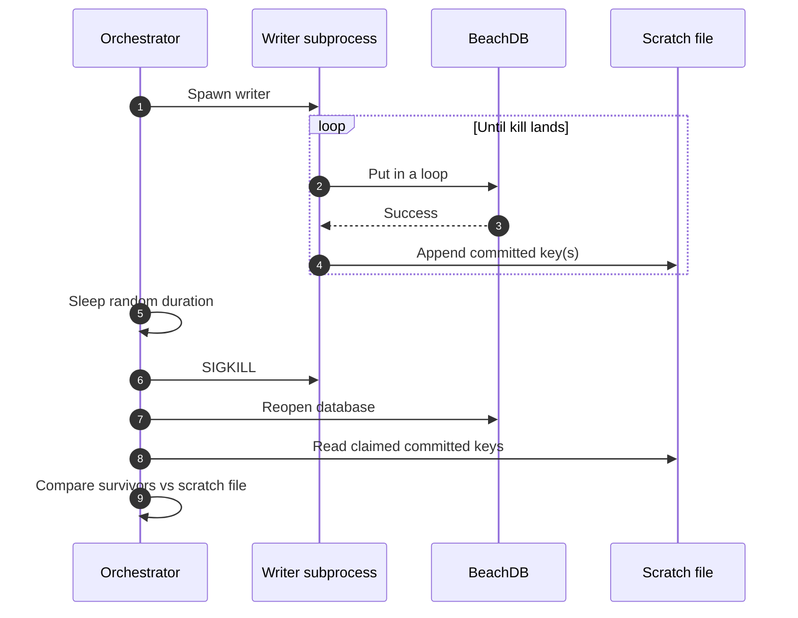
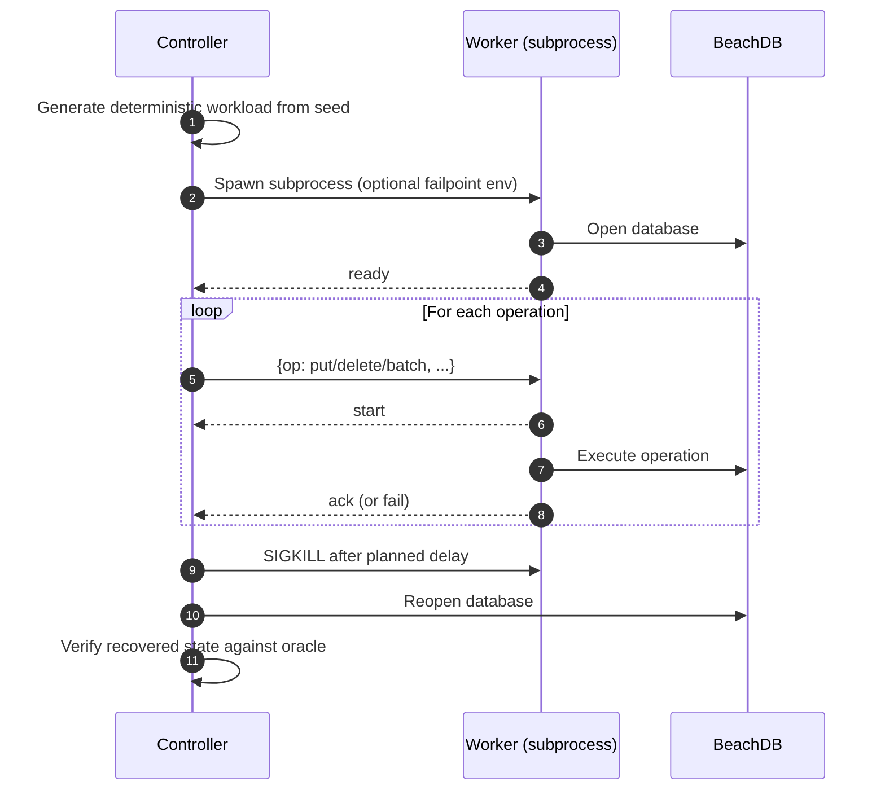

> **TL;DR**: BeachDB v0.0.4 turns crash testing from random `SIGKILL`s into crashes aimed at named engine boundaries. It ships a controller/worker harness, replayable artifacts, and a tiny `crashhook` layer with failpoints across the WAL and flush paths. The goal is simple: stop asking "did it survive?" and start asking "what exactly survived, at which boundary, and why?"
>
> [Code is here](https://github.com/aalhour/beachdb/tree/v0.0.4).
{: .prompt-info }

_This is part of an ongoing series — see all posts tagged [#beachdb](/tags/beachdb/)._

---

## A blunt instrument

BeachDB has had crash testing since [v0.0.1](https://github.com/aalhour/beachdb/tree/v0.0.1/cmd/crash). The original setup was simple: spawn a writer subprocess that writes keys in a loop, wait a random number of milliseconds, `kill -9` the process, reopen the database, check what survived. I first mentioned it in the "Crash recovery" section of the [WAL post]().

That was good enough for the first question I cared about: does the WAL actually work, or am I just telling myself a nice story about durability? It caught real bugs. It gave me confidence that acknowledged writes survive process death.

But it was still a blunt instrument. It could tell me that something survived. It could not tell me why. And it definitely could not tell me at which internal boundary the process died.

At a high level, the old setup looked like this:



Not useless. Just fuzzy in exactly the places I now cared about.

## One exact boundary I wanted to test

At some point I stopped wanting "more random kills" and started wanting one very specific answer.

Suppose a `Put()` crosses the WAL `fsync` boundary, and then the process dies before the normal write path finishes.

What should happen on reopen?

For that boundary, the answer should be: the write comes back.

If the WAL append happened, the `fsync` returned, and the process dies before it gets to finish the rest of the path, recovery should replay that WAL record and rebuild the state. That is the whole point of the log in the first place.

> Scope note: this harness models **process death in a surviving kernel**. That distinction matters. This is not a power-loss / kernel-panic / "the machine fell into the sea" test harness. In a process-crash test, buffered bytes, kernel page cache state, and already-`fsync`'d data all behave differently. The harness needs to keep those boundaries honest.
{: .prompt-warning }

That may sound obvious written out like this, but the old crash loop could only exercise that boundary accidentally. It could kill the process _around_ the `fsync`. It could not tell me, with a straight face, that the kill landed _after_ the `fsync` and _before_ the rest of the write path.

That was the itch.

## Why wall-clock kills were not enough

Once I looked at the problem through that one boundary, the limitation of wall-clock kills became obvious.

Random `SIGKILL`s are realistic, but sloppy. They tell you the process died somewhere during the write path. They do not tell you whether it died before the WAL append, after the append, after `fsync`, or halfway through building an SSTable.

The old setup also had three practical problems I kept tripping over:

- **Non-deterministic timing.** "It failed once at cycle 37" is not a debugging strategy.
- **Coarse verification.** The orchestrator only knew which keys the writer _claimed_ it committed through a scratch file with newline-delimited keys. There was no clean notion of "acked vs. in-flight" at the operation boundary.
- **No internal visibility.** I could kill from the outside, but I could not target "right after WAL sync" or "force SSTable publish to fail."

So the new harness had to buy me four things:

1. A deterministic workload I can replay exactly.
2. A protocol that tells me, for each operation, whether the subprocess started it, acked it, or failed it.
3. The ability to crash or inject faults at named internal engine boundaries.
4. An artifact from each run that I can inspect, replay, and diff.

## The new architecture: controller and worker

The new harness splits cleanly into two processes with boring, explicit jobs.



The **controller** owns the workload, the crash/fault schedule, the oracle, and the artifact written at the end of the run. It does not participate in the write path itself. It only touches BeachDB directly when it reopens the database after a kill or an injected failure.

The **worker** is intentionally thin: receive one operation at a time on stdin, call the BeachDB API, emit lifecycle events on stdout. The protocol between them is NDJSON with base64-encoded keys and values, so binary payloads survive the round trip without text-parser nonsense.

And yes, the harness is deliberately slow.

The old writer generated its own keys in a loop, which meant the controller had no precise idea which operation was in flight when the kill landed. The new one does one operation at a time: one op, one `start`, one `ack`/`fail`, then move on. Throughput goes down. Signal goes up. For a crash harness, that trade is not exactly heartbreaking.

## The contract the harness now enforces

That architecture gives the harness a protocol, and the protocol gives the harness a contract.

The worker emits four lifecycle events:

- `ready` - database is open
- `start` - about to execute the operation
- `ack` - the operation succeeded and the DB call returned `nil`
- `fail` - the operation returned an error

From those events, the controller enforces a conservative harness-wide contract:

- **Acked operations** must be reflected after recovery.
- **The single started-but-not-acked operation** is indeterminate by default. It may be present or absent after reopen.
- **Never-started operations** are irrelevant to that crash cycle.

That "single ambiguous operation" rule is the big upgrade over the old harness. The commit frontier is no longer fuzzy.

There is one important nuance, though: this is the harness's default contract, not a custom proof rule for every failpoint.

Some boundaries deserve stronger claims. `wal_after_sync` is one of them: once the WAL `fsync` boundary is crossed, I expect recovery to bring the write back. But in v0.0.4, the oracle stays conservative: a started-but-not-acked operation is still allowed to be present or absent. The artifact tells me exactly where the process died; the oracle does not yet encode per-failpoint rules.

`wal_after_append` is different. `wal.Writer.Append` writes into a `bufio.Writer`, so the record may still be sitting in process memory. It has not crossed the durable boundary, and may not even have reached the kernel yet. That operation must **not** be treated as durably acknowledged.

That is one of those annoying details that becomes less annoying once it saves you from lying in a blog post.

In the engine, that write-path boundary looks like this:

```go
// Append the changes to the WAL file via wal.Writer
if err := db.wal.Append(encoded); err != nil {
    return fmt.Errorf("beachdb: appending to WAL: %w", err)
}

// FAILPOINT: wal_after_append
crashhook.CrashIfArmed(crashhook.PointWALAfterAppend)

// Try to sync the WAL to disk if the option is set
if err := db.syncWALLocked(); err != nil {
    return err
}

// Apply the Batch operations to Memtable
db.applyOperations(ops)
```

And inside `syncWALLocked()`:

```go
// FAILPOINT: wal_sync_error
if err := crashhook.MaybeFault(crashhook.FaultWALSyncError); err != nil {
    return fmt.Errorf("beachdb: syncing WAL: %w", err)
}

if err := db.wal.Sync(); err != nil {
    return fmt.Errorf("beachdb: syncing WAL: %w", err)
}

// FAILPOINT: wal_after_sync
crashhook.CrashIfArmed(crashhook.PointWALAfterSync)
```

That is the write-path boundary in code form: append into the WAL writer, optional crash, flush + sync, optional crash, then move on.

## Replayable artifacts

Every run starts with a seed. That seed determines the workload: which keys, which values, which operations, in what order. The crash schedule is derived from it too.

That means a failing run is not "well... something weird happened once." It is a replayable artifact.

```bash
./bin/crash replay \
  --artifact=/tmp/beachdb-crash-artifacts/crash-20260419T213015.123Z.json \
  --dbdir=/tmp/beachdb-crash-replay-db
```

The artifact captures the things I actually care about:

- the run configuration and seed
- the generated workload
- the ordered stream of worker events
- per-cycle metadata and verification results
- the last acknowledged op ID
- the first failure, if there was one

One cycle's evidence in the artifact looks more like this:

```json
{
  "seed": 42,
  "last_acked_op_id": 16,
  "events": [
    {"cycle": 0, "event": {"kind": "ready"}},
    {"cycle": 0, "event": {"kind": "start", "op_id": 17}}
  ],
  "cycles": [
    {
      "index": 0,
      "exit_code": 86,
      "last_event": {"kind": "start", "op_id": 17},
      "verification": {
        "checked_keys": 23,
        "allowed_optional_ops": [17]
      },
      "crash_point": "wal_after_sync"
    }
  ]
}
```

> That is trimmed for readability, but it shows the important shape: worker events in one stream, cycle-level metadata in another, and enough information to replay the run and reason about the last in-flight operation.
{: .prompt-info }

This would have saved me hours during the SSTable milestone. Instead of "it failed once and now I can't make it fail again," I get a file I can hand to someone else and say: here, run this.

## Failpoints and hook sites

The controller/worker split solves the "what was in flight?" problem. It does **not** solve the "crash exactly here" problem.

An external `SIGKILL` is still subject to scheduler timing. Useful, realistic, but imprecise.

That is what BeachDB's tiny internal `crashhook` layer is for. It is not the crash harness itself; the harness lives under `cmd/crash`.[^1] The hook package is just the small internal layer that lets the harness aim at named engine boundaries.[^2]

> The shape is modeled after RocksDB's test-only kill points: named hooks in the engine, normally dormant, armed by a stress/crash harness when you want the process to die at a particular edge.[^3][^4] BeachDB's version is smaller, less general, and wearing floaties in the shallow end.
> 
> Other engines attack similar bugs from different angles: LevelDB has recovery/corruption tests, Pebble models crashable filesystems, and Badger keeps a Jepsen-inspired bank workload around transactional invariants.[^5][^6][^7]
{: .prompt-tip }

BeachDB keeps the implementation intentionally boring:

1. put named hooks in engine code paths
2. leave them dormant by default
3. arm them through the worker process environment
4. when triggered, either crash the process or return a synthetic error

The hook layer lives in `internal/crashhook` and exposes two primitives:

- `CrashIfArmed(point)` - if the named point is armed, call `os.Exit(86)` immediately
- `MaybeFault(point)` - if the named point is armed, return a synthetic error

Both are activated by environment variables passed from the controller to the worker subprocess. In normal operation they are inert.

The implementation is intentionally tiny:

```go
func CrashIfArmed(point string) {
    if point == "" || os.Getenv(EnvCrashPoint) != point {
        return
    }
    if !crashConsumed.CompareAndSwap(false, true) {
        return
    }
    exitFunc(CrashExitCode)
}

func MaybeFault(point string) error {
    if point == "" || os.Getenv(EnvFaultPoint) != point {
        return nil
    }
    if !faultConsumed.CompareAndSwap(false, true) {
        return nil
    }
    
    switch point {
    case FaultWALSyncError:
        return ErrInjectedWALSync
    case FaultSSTPublishError:
        return ErrInjectedSSTPublish
    case FaultSSTWriteError:
        return ErrInjectedSSTWrite
    default:
        return nil
    }
}
```

I like this shape a lot because it keeps the hook layer boring on purpose: environment variables arm the point, atomics make it one-shot per process, and the engine code gets tiny, readable hook sites.

There are seven hook sites in the engine right now, and every one is marked with a `// FAILPOINT:` comment so I can find them all with one grep:

```bash
$ grep -rn "// FAILPOINT:" engine/
engine/db.go:191:  // FAILPOINT: wal_after_append
engine/db.go:411:  // FAILPOINT: wal_sync_error
engine/db.go:420:  // FAILPOINT: wal_after_sync
engine/db.go:652:  // FAILPOINT: sst_publish_error
engine/db.go:662:  // FAILPOINT: flush_after_publish
engine/db.go:677:  // FAILPOINT: sst_write_error
engine/db.go:726:  // FAILPOINT: flush_after_file_sync
```

They fall into two buckets: **crash points**, which simulate process death, and **fault points**, which inject errors and let the process keep unwinding normally.

The important thing to remember is that the "current oracle rule" column describes what `v0.0.4` enforces automatically, not necessarily the strongest claim I eventually want the engine to prove.

> Wide table ahead, make sure to scroll right to see all columns!
{: .prompt-warning }

| Failpoint | Type | Boundary | Current oracle rule | Future stricter rule |
|---|---|---|---|---|
| `wal_after_append` | Crash | WAL writer accepted the record, but before flush and `fsync` | Pending op may be present or absent | Same |
| `wal_after_sync` | Crash | WAL `fsync` returned | Pending op may be present or absent | Pending op must be present |
| `wal_sync_error` | Fault | WAL sync returns a synthetic error | Operation must not be acked | Same |
| `sst_write_error` | Fault | SSTable write fails before touching the filesystem | Operation must fail cleanly | Same |
| `flush_after_file_sync` | Crash | SSTable file and parent directory are durable on disk | Startup must remain coherent | Manifest should define ownership precisely |
| `sst_publish_error` | Fault | SSTable exists on disk, but publish fails | Reopen must remain coherent | Manifest should define ownership precisely |
| `flush_after_publish` | Crash | SSTable is published into the engine's in-memory state | Reopen must remain coherent | Manifest should make this explicit |

That distinction matters.

`wal_after_sync` is a crash point at a durable boundary. The process dies after the WAL sync returns, and on reopen I expect WAL replay to recover the write. The current oracle does not enforce that special case yet, but the artifact makes the boundary visible enough to inspect and replay.

`sst_publish_error` is different. It is a synthetic error path. The interesting question is not "did the process die?" but "if the SSTable file already exists on disk and publish fails, does reopen still recover coherently?"

`wal_after_append` is the sneaky one. The process dies after the WAL writer accepted the record into its buffer, before the flush and before the durable boundary. In this harness, that operation is not acknowledged as durable, and after reopen it may or may not be present. The important rule is not whether it sometimes appears. The important rule is that the harness is not allowed to require it.

The flush path has the same shape:

```go
func (db *DB) publishFlushedSSTLocked(sstReader *sstable.Reader) error {
    // FAILPOINT: sst_publish_error
    if err := crashhook.MaybeFault(crashhook.FaultSSTPublishError); err != nil {
        return fmt.Errorf("beachdb: publishing SSTable: %w", err)
    }

    db.flushErr = nil
    db.ssts = append(db.ssts, sstReader)
    db.immMem = nil
    db.nextSSTID++

    // FAILPOINT: flush_after_publish
    crashhook.CrashIfArmed(crashhook.PointFlushAfterPublish)

    return nil
}
```

And during file creation itself:

```go
// FAILPOINT: sst_write_error
if err := crashhook.MaybeFault(crashhook.FaultSSTWriteError); err != nil {
    return nil, fmt.Errorf("beachdb: writing SSTable: %w", err)
}

// Sync parent directory so the new file's directory entry is durable
if err = syncDir(filepath.Dir(path)); err != nil {
    return nil, fmt.Errorf("beachdb: syncing directory after flush: %w", err)
}

// FAILPOINT: flush_after_file_sync
crashhook.CrashIfArmed(crashhook.PointFlushAfterFileSync)
```

That tiny footprint is one of my favorite parts of the whole thing. One comment, one call, and suddenly the engine has named edges I can attack on purpose.

## Oracle and invariants

The last piece is the oracle that runs after every crash/reopen cycle.

This is **not** just a bag of "acked keys." That would be too naive once the workload starts overwriting keys or deleting them.

Instead, the oracle builds the final expected visible state from the ordered stream of acked operations:

- later `Put`s overwrite earlier visible values for the same key
- `Delete`s turn that key into a tombstone / not-found state
- batch operations expand into their nested `Put` / `Delete` items and are applied in order too
- the expected answer is the final visible state after applying the acked prefix in order

After reopening the database, the controller reads the relevant keys back and checks:

1. the visible state derived from acked operations matches what the database returns
2. the single started-but-not-acked operation is allowed to be present or absent
3. keys that were never started do not magically appear with values they were never given

That is basically reference-model testing stretched across a process boundary. BeachDB already uses the same idea in `internal/testutil.Model` for unit tests. Here I am just applying it to crash cycles instead of in-process data structures.

The obvious next step is to teach the oracle boundary-specific expectations. For example, `wal_after_sync` should eventually mean: "this pending operation crossed the durable WAL boundary, so missing after recovery is a failure." v0.0.4 gives me the artifact and exact crash point first; stricter assertions can grow on top.

## Running it

A short smoke run:

```bash
make crash-check
```

A longer local run:

```bash
./bin/crash run \
  --dbdir=/tmp/beachdb-crash-db \
  --artifact-dir=/tmp/beachdb-crash-artifacts \
  --cycles=500 \
  --seed=42 \
  --ops=1000
```

And replaying a failure:

```bash
./bin/crash replay \
  --artifact=/tmp/beachdb-crash-artifacts/crash-20260419T213015.123Z.json \
  --dbdir=/tmp/beachdb-crash-replay-db
```

## What changed in my confidence

The biggest lesson was not about crash testing specifically. It was about the gap between "tests pass" and "I trust this."

The old harness gave me green tests and a general sense that the durability story was probably fine. The new one lets me target exact boundaries, inspect the evidence, and grow the oracle toward sharper boundary-specific claims.

That is a different kind of confidence.

Once I could say "crash here, at this exact internal edge" or "inject this exact fault after the file is already durable," the whole discussion got sharper. The durability story stopped being "I wrote a lot of tests and they pass" and started being "I can tell you what happens at this boundary, why it happens, and which artifact proves it."

That is the kind of evidence I want from a storage engine, even a toy one.

## What's next

The next milestone is **Manifest**.

That is not just "metadata." It is the thing that will let BeachDB say which SSTables belong to the current durable view of the database. Right now, startup discovers `*.sst` files by scanning the directory. That is simple, honest, and temporary.

The crash harness in this post gives me the weapon. The manifest gives me better targets.

After that: merge iteration, compaction, and the slow process of turning “a bunch of sorted files” into a coherent version history.

Until we meet again.

Adios! ✌🏼

---

## Notes & references

[^1]: BeachDB v0.0.4 crash harness implementation: [`cmd/crash/`](https://github.com/aalhour/beachdb/tree/v0.0.4/cmd/crash)
[^2]: BeachDB v0.0.4 crash hook layer: [`internal/crashhook/crashhook.go`](https://github.com/aalhour/beachdb/blob/v0.0.4/internal/crashhook/crashhook.go)
[^3]: RocksDB's crash-test driver: [`tools/db_crashtest.py`](https://github.com/facebook/rocksdb/blob/main/tools/db_crashtest.py). The whitebox mode runs `db_stress` with `kill_random_test`, which is the closest ancestor of the shape I wanted.
[^4]: RocksDB's test hook machinery: [`test_util/sync_point.h`](https://github.com/facebook/rocksdb/blob/main/test_util/sync_point.h). The `TEST_KILL_RANDOM` and `TEST_SYNC_POINT` macros are the important bits for this post.
[^5]: LevelDB has smaller but still useful recovery/fault-injection examples in [`db/fault_injection_test.cc`](https://github.com/google/leveldb/blob/main/db/fault_injection_test.cc) and [`db/corruption_test.cc`](https://github.com/google/leveldb/blob/main/db/corruption_test.cc).
[^6]: Pebble's current test filesystem has a nice explicit crash model in [`vfs/mem_fs.go`](https://github.com/cockroachdb/pebble/blob/master/vfs/mem_fs.go), especially `NewCrashableMem` and `CrashClone`.
[^7]: Badger is a less direct failpoint reference, but a useful adjacent example: its README calls out filesystem-anomaly testing, and its Jepsen-inspired bank workload lives in [`badger/cmd/bank.go`](https://github.com/dgraph-io/badger/blob/main/badger/cmd/bank.go), with a nightly workflow in [`ci-badger-bank-tests-nightly.yml`](https://github.com/dgraph-io/badger/blob/main/.github/workflows/ci-badger-bank-tests-nightly.yml).
